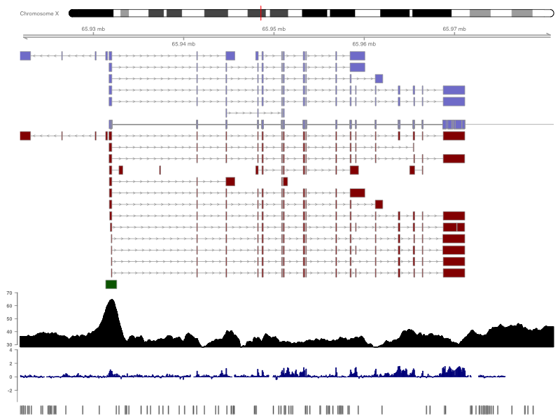

# _Gviz_ - Plotting data and annotation information along genomic coordinates

## Software status

<!-- badges: start -->
[](http://www.repostatus.org/#active)
[](https://bioconductor.org/packages/Gviz) 
[](https://bioconductor.org/packages/stats/bioc/Gviz/)
[](https://support.bioconductor.org/t/gviz/)
[](https://opensource.org/licenses/Artistic-2.0)
[](https://github.com/ivanek/Gviz/issues)
<!-- badges: end -->

&nbsp;

|                     | Bioc ([release](https://bioconductor.org/packages/release/bioc/html/Gviz.html)) | Bioc ([devel](https://bioconductor.org/packages/devel/bioc/html/Gviz.html)) |
|:--------------------|----------------------------------------------------------------------------:|--------------------------------------------------------------------------------:|
| OS                  | [](https://bioconductor.org/checkResults/release/bioc-LATEST/Gviz/) | [](https://bioconductor.org/checkResults/devel/bioc-LATEST/Gviz/) |
| Bioc Last Update    | [](https://bioconductor.org/checkResults/release/bioc-LATEST/Gviz/) | [](https://bioconductor.org/checkResults/devel/bioc-LATEST/Gviz/) |
| Bioc Status         | [](https://bioconductor.org/checkResults/release/bioc-LATEST/Gviz) | [](https://bioconductor.org/checkResults/devel/bioc-LATEST/Gviz) |
| GitHub Last Commit  | [](https://github.com/ivanek/Gviz/tree/RELEASE_3_17) | [](https://github.com/ivanek/Gviz/tree/devel/) |
| GitHub Actions      | [](https://github.com/ivanek/Gviz/actions) | [](https://github.com/ivanek/Gviz/actions) |
| Coverage            | [](https://codecov.io/gh/ivanek/Gviz/branch/RELEASE_3_17) | [](https://codecov.io/github/ivanek/Gviz) |

## Authors

- Florian Hahne
- Steffen Durinck
- Robert Ivanek
- Arne Mueller
- Steve Lianoglou
- Ge Tan 
- Lance Parsons
- Shraddha Pai

## Overview



Genomic data analyses requires integrated visualization of known genomic information and new experimental data. Gviz uses the [biomaRt](https://bioconductor.org/packages/biomaRt/) and the [rtracklayer](https://bioconductor.org/packages/rtracklayer/) packages to perform live annotation queries to [Ensembl](https://www.ensembl.org/) and [UCSC](https://genome.ucsc.edu) and translates this to e.g. gene/transcript structures in viewports of the grid graphics package. This results in genomic information plotted together with your data.

## Installation

#### Release version

```
if (!requireNamespace("BiocManager", quietly = TRUE))
    install.packages("BiocManager")
BiocManager::install("Gviz", version = "release")
```

#### Developmental version

```
if (!requireNamespace("BiocManager", quietly = TRUE))
    install.packages("BiocManager")
BiocManager::install("Gviz", version = "devel")
```

#### Github

```
if (!requireNamespace("remotes", quietly = TRUE))
    install.packages("remotes")
remotes::install_github("ivanek/Gviz")
```
## Usage

For detailed instructions check the package vignette 
([release](https://bioconductor.org/packages/release/bioc/vignettes/Gviz/inst/doc/Gviz.html) 
or 
[developmental](https://bioconductor.org/packages/devel/bioc/vignettes/Gviz/inst/doc/Gviz.html) 
version). Or check the [GitHub.io page](https://ivanek.github.io/Gviz/).

## Citation 

- Hahne F, Ivanek R (2016). "Statistical Genomics: Methods and Protocols." In Mathé E, Davis S (eds.), chapter Visualizing Genomic Data Using Gviz and Bioconductor, 335–351. Springer New York, New York, NY. ISBN 978-1-4939-3578-9, doi: [10.1007/978-1-4939-3578-9_16](https://dx.doi.org/10.1007/978-1-4939-3578-9_16).
