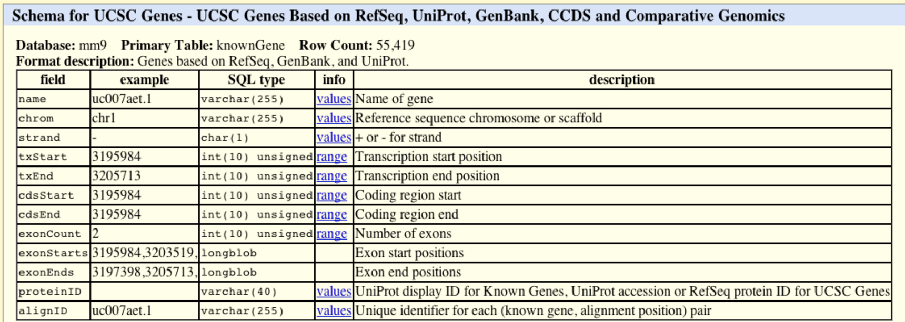

__Last edited__: 19 May 2020

```{r init, echo=FALSE, results='hide'}
library(knitr)

## 1. issue with too large vignette, maybe optimizing png?
## unfortunately it requires additional system libs -> not feasible
##           `pngquant=""`, `optipng = "-o7"` both in `opts_chunk`
## SOLUTION: might be to use `fig.retina = 1` and only set it to 2 (default)
##           for figures which requires higher resolution
##           or even decrease res `dpi = 72`, also both in `opts_chunk`
## 
## knit_hooks$set(optipng = hook_optipng,
##                pngquant = hook_pngquant)
##
## 2. crop=NULL or FALSE =>  fix vignette rendering based on yihui/knitr#1796
## added also error=FALSE to include_graphics

opts_chunk$set(
  collapse = TRUE,
  tidy = FALSE,
  fig.retina = 1,
  ## comment = "#>",
  error = FALSE,
  warning = FALSE,
  message = FALSE,
  crop = NULL                           
)

## check the output type
out_type <- opts_knit$get("rmarkdown.pandoc.to")
if (is.null(out_type))
    out_type <- "html"

## add styling
if (out_type == "html") {
    BiocStyle::markdown()
} else if (out_type == "latex") {
    BiocStyle::latex()
}
```

```{r vignetteGvizSetup, echo=FALSE, results='hide'}
source(system.file("scripts/documentation.R", package="Gviz"))
xtabDetails <- details

addParTable <- function(xtabDetails, class, 
                        skip=c("showTitle", "size", "background.title"), 
                        add=NULL, out_type="html") {
  Parameters <- data.frame("Display Parameter"=names(xtabDetails[[class]]),
                           "Description"=xtabDetails[[class]], 
                           check.names=FALSE)
  if(!is.null(add)) {
    Parameters <- cbind(Parameters, add)
  }
  Parameters <- Parameters[order(Parameters[,1]),]  
  sel <- !Parameters[,1] %in% skip
  Parameters <- Parameters[sel,]
  Parameters[,2] <- gsub("\\\\\\code\\{(.*?)\\}", "`\\1`", Parameters[,2])
  Parameters[,2] <- gsub("\\\\\\link[sS]4[Cc]lass\\{(.*?)\\}", "\\1", 
                         Parameters[,2])
  Parameters[,2] <- gsub("\\\\\\link\\{(.*?)\\}", "\\1", Parameters[,2])
  rownames(Parameters) <- NULL
  if (out_type == "html") {
     out <- kable(Parameters)
  } else if (out_type == "latex") {
     out <- kable(Parameters, format="latex", booktabs=TRUE, longtable=TRUE)
  }
  print(out)
  return(invisible())
}

## hasUcscConnection <- !is(try(rtracklayer::browserSession(), silent=TRUE), "try-error")
hasUcscConnection <- FALSE
## oto <- options(timeout=5)
hasBiomartConnection <- FALSE
## hasBiomartConnection <- (!is(try(download.file("http://www.biomart.org", tempfile(), quiet=TRUE)), "try-error") &&
##                          !is(try(biomaRt::listMarts(), silent=TRUE), "try-error"))
## options(timeout=oto)

## ## clear BiomaRt cache
## biomaRt::biomartCacheClear()

## ## Uncommenting this helps when the UCSC server has a hickup but still lets you connect:
## hasUcscConnection <- !is(try(rtracklayer::browserSession(), silent=TRUE), "try-error") && 
##   !is(try(IdeogramTrack(genome="hg19", chromosome=7), silent=TRUE), "try-error")
```

# Introduction

In order to make sense of genomic data one often aims to plot such
data in a genome browser, along with a variety of genomic annotation
features, such as gene or transcript models, CpG island, repeat
regions, and so on. These features may either be extracted from public
data bases like ENSEMBL or UCSC, or they may be generated or curated
in-house. Many of the currently available genome browsers do a
reasonable job in displaying genome annotation data, and there are
options to connect to some of them from within `R` (e.g., using the
`r Biocpkg("rtracklayer")` package). However, none of these solutions
offer the flexibility of the full `R` graphics system to display large
numeric data in a multitude of different ways. The `r Biocpkg("Gviz")`
package [@Hahne2016] aims to close this gap by providing a structured
visualization framework to plot any type of data along genomic
coordinates. It is loosely based on the `r Biocpkg("GenomeGraphs")`
package by Steffen Durinck and James Bullard, however the complete
class hierarchy as well as all the plotting methods have been
restructured in order to increase performance and flexibility. All
plotting is done using the grid graphics system, and several
specialized annotation classes allow to integrate publicly available
genomic annotation data from sources like
[UCSC](https://genome.ucsc.edu/) or
[ENSEMBL](https://www.ensembl.org/). 


# Basic Features

The fundamental concept behind the `r Biocpkg("Gviz")` package is similar to the
approach taken by most genome browsers, in that individual types of
genomic features or data are represented by separate tracks. Within
the package, each track constitutes a single object inheriting from
class `GdObject`, and there are constructor functions as well
as a broad range of methods to interact with and to plot these
tracks. When combining multiple objects, the individual tracks will
always share the same genomic coordinate system, thus taking the
burden of aligning the plot elements from the user.

It is worth mentioning that, at a given time, tracks in the sense of the
`r Biocpkg("Gviz")` package are only defined for a single chromosome on a specific 
genome, at least for the duration of a given plotting operation. You will later see
that a track may still contain information for multiple chromosomes,
however most of this is hidden except for the currently active
chromosome, and the user will have to explicitly switch the chromosome
to access the inactive parts. While the package in principle imposes
no fixed structure on the chromosome or on the genome names, it makes
sense to stick to a standardized naming paradigm, in particular when
fetching additional annotation information from online resources. By
default this is enforced by a global option
`ucscChromosomeNames`, which is set during package loading and
which causes the package to check all supplied chromosome names for
validity in the sense of the UCSC definition (chromosomes have to
start with the `chr` string). You may decide to turn this feature
off by calling `options(ucscChromosomeNames=FALSE)`. For the
remainder of this vignette however, we will make use of the UCSC
genome and chromosome identifiers, e.g., the `chr7` chromosome
on the mouse `mm9` genome.

The different track classes will be described in more detail in the
\@ref(track-classes) section further below. For now, let's just
take a look at a typical `r Biocpkg("Gviz")` session to get an idea of what this is
all about. We begin our presentation of the available functionality by
loading the package:

```{r loadPackage, cache=FALSE}
library(Gviz)
```

The most simple genomic features consist of start and stop
coordinates, possibly overlapping each other. CpG islands or
microarray probes are real life examples for this class of
features. In the Bioconductor world those are most often represented
as run-length encoded vectors, for instance in the `IRanges`
and `GRanges` classes. To seamlessly integrate with other
Bioconductor packages, we can use the same data structures to generate
our track objects. A sample set of CpG island coordinates has been
saved in the `cpgIslands` object and we can use that for our
first annotation track object. The constructor function
`AnnotationTrack` is a convenient helper to create the
object.

```{r AnnotationTrack}
library(GenomicRanges)
data(cpgIslands)
class(cpgIslands)
chr <- as.character(unique(seqnames(cpgIslands)))
gen <- genome(cpgIslands)
atrack <- AnnotationTrack(cpgIslands, name = "CpG")
```

Please note that the `AnnotationTrack` constructor (as most
constructors in this package) is fairly flexible and can accommodate
many different types of inputs. For instance, the start and end
coordinates of the annotation features could be passed in as
individual arguments `start` and `end`, as a
`data.frame` or even as an `IRanges` or
`GRangesList` object. Furthermore, a whole bunch of coercion
methods are available for those package users that prefer the more
traditional R coding paradigm, and they should allow operations along
the lines of `as(obj, 'AnnotationTrack')`. You may want to
consult the class' manual page for more information, or take a look at
the \@ref(bioconductor-integration) section for a listing of the
most common data structures and their respective counterparts in the
`r Biocpkg("Gviz")` package.

With our first track object being created we may now proceed to the
plotting. There is a single function `plotTracks` that
handles all of this. As we will learn in the remainder of this
vignette, `plotTracks` is quite powerful and has a number of
very useful additional arguments. For now we will keep things very
simple and just plot the single CpG islands annotation track.

```{r plotAnnotationTrack, fig.width=7.5, fig.height=0.5}
plotTracks(atrack)
```

As you can see, the resulting graph is not particularly
spectacular. There is a title region showing the track's name on a
gray background on the left side of the plot and a data region showing
the seven individual CpG islands on the right. This structure is
similar for all the available track objects classes and it somewhat
mimics the layout of the popular UCSC Genome Browser. If you are not
happy with the default settings, the `r Biocpkg("Gviz")`
package offers a multitude of options to fine-tune the track
appearance, which will be shown in the \@ref(plotting-parameters)
section.

Apart from the relative distance of the CpG islands, this
visualization does not tell us much. One obvious next step would be to
indicate the genomic coordinates we are currently looking at in order
to provide some reference. For this purpose, the `r Biocpkg("Gviz")` package offers
the `GenomeAxisTrack` class. Objects from the class can be
created using the constructor function of the same name.

```{r GenomeAxisTrack}
gtrack <- GenomeAxisTrack()
```

Since a `GenomeAxisTrack` object is always relative to the
other tracks that are plotted, there is little need for additional
arguments. Essentially, the object just tells the
`plotTracks` function to add a genomic axis to the
plot. Nonetheless, it represent a separate annotation track just as
the CpG island track does. We can pass this additional track on to
`plotTracks` in the form of a list.

```{r plotGenomeAxisTrack, fig.width=7.5, fig.height=1.1}
plotTracks(list(gtrack, atrack))
```

You may have realized that the genomic axis does not take up half of
the available vertical plotting space, but only uses the space
necessary to fit the axis and labels. Also the title region for this
track is empty. In general, the `r Biocpkg("Gviz")` package tries to find reasonable
defaults for all the parameters controlling the look and feel of a
plots so that appealing visualizations can be created without too much
tinkering. However, all features on the plot including the relative
track sizes can also be adjusted manually.

As mentioned before in the beginning of this vignette, a plotted track
is always defined for exactly one chromosome on a particular
genome. We can include this information in our plot by means of a
chromosome ideogram. An ideogram is a simplified visual representation
of a chromosome, with the different chromosomal staining bands
indicated by color, and the centromere (if present) indicated by the
shape. The necessary information to produce this visualization is
stored in online data repositories, for instance at UCSC. The `r Biocpkg("Gviz")`
package offers very convenient connections to some of these
repositories, and the `IdeogramTrack` constructor function is
one example for such a connection. With just the information about a
valid UCSC genome and chromosome, we can directly fetch the chromosome
ideogram information and construct a dedicated track object that can
be visualized by `plotTracks`. Please not that you will need
an established internet connection for this to work, and that fetching
data from UCSC can take quite a long time, depending on the server
load. The `r Biocpkg("Gviz")` package tries to cache as much data as possible to
reduce the bandwidth in future queries.

```{r showIdeogramTrack, eval=FALSE}
itrack <- IdeogramTrack(genome = gen, chromosome = chr)
```

```{r doIdeogramTrack, echo=FALSE, results='hide'}
if(hasUcscConnection) {
  itrack <- IdeogramTrack(genome = gen, chromosome = chr)
} else{
  data(itrack)
}
```

Similar to the previous examples, we stick the additional track object
into a list in order to plot it.

```{r plotIdeogramTrack, fig.width=7.5, fig.height=1.5}
plotTracks(list(itrack, gtrack, atrack))
```

Ideogram tracks are the one exception in all of `r Biocpkg("Gviz")`'s track objects
in the sense that they are not really displayed on the same coordinate
system like all the other tracks. Instead, the current genomic
location is indicated on the chromosome by a red box (or, as in this
case, a red line if the width is too small to fit a box).

So far we have only looked at very basic annotation features and how
to give a point of reference to our plots. Naturally, we also want to
be able to handle more complex genomic features, such as gene
models. One potential use case would be to utilize gene model
information from an existing local source. Alternatively, we could
download such data from one of the available online resources like UCSC
or ENSEBML, and there are constructor functions to handle these
tasks. For this example we are going to load gene model data from a
stored `data.frame`. The track class of choice here is a
`GeneRegionTrack` object, which can be created via the
constructor function of the same name. Similar to the
`AnnotationTrack` constructor there are multiple possible ways
to pass in the data.

```{r GeneRegionTrack, fig.width=7.5, fig.height=3}
data(geneModels)
grtrack <- GeneRegionTrack(geneModels, genome = gen,
                           chromosome = chr, name = "Gene Model")
plotTracks(list(itrack, gtrack, atrack, grtrack))
```

In all those previous examples the plotted genomic range has been
determined automatically from the input tracks. Unless told otherwise,
the package will always display the region from the leftmost item to
the rightmost item in any of the tracks.  Of course such a static view
on a chromosomal region is of rather limited use. We often want to
zoom in or out on a particular plotting region to see more details or
to get a broader overview. To that end, `plotTracks`
supports the `from` and `to` arguments that let us
choose an arbitrary genomic range to plot.

```{r zooming, fig.width=7.5, fig.height=2.2}
plotTracks(list(itrack, gtrack, atrack, grtrack),
           from = 26700000, to = 26750000)
```

Another pair of arguments that controls the zoom state are
`extend.left` and `extend.right`. Rather than `from` and `to`, 
those arguments are relative to the
currently displayed ranges, and can be used to quickly extend the view
on one or both ends of the plot. In addition to positive or negative
absolute integer values one can also provide a float value between -1
and 1 which will be interpreted as a zoom factor, i.e., a value of 0.5
will cause zooming in to half the currently displayed range.

```{r zooming2, fig.width=7.5, fig.height=3}
plotTracks(list(itrack, gtrack, atrack, grtrack),
           extend.left = 0.5, extend.right = 1000000)
```

You may have noticed that the layout of the gene model track has
changed depending on the zoom level. This is a feature of the `r Biocpkg("Gviz")`
package, which automatically tries to find the optimal visualization
settings to make best use of the available space. At the same time,
when features on a track are too close together to be plotted as
separate items with the current device resolution, the package will
try to reasonably merge them in order to avoid overplotting.

Often individual ranges on a plot tend to grow quite narrow, in
particular when zooming far out, and a couple of tweaks become helpful
in order to get nice plots, for instance to drop the bounding borders
of the exons.

```{r zooming3, fig.width=7.5, fig.height=3}
plotTracks(list(itrack, gtrack, atrack, grtrack), 
           extend.left = 0.5, extend.right = 1000000, col = NULL)
```

When zooming further in it may become interesting to take a look at
the actual genomic sequence at a given position, and the `r Biocpkg("Gviz")` package
provides the track class `SequenceTrack` that let's you do just
that. Among several other options it can draw the necessary sequence
information from one of the `BSgenome` packages.

```{r zooming4, fig.width=7.5, fig.height=3.1}
library(BSgenome.Hsapiens.UCSC.hg19)
strack <- SequenceTrack(Hsapiens, chromosome = chr)
plotTracks(list(itrack, gtrack, atrack, grtrack, strack), 
           from = 26591822, to = 26591852, cex = 0.8)
```

So far we have replicated the features of a whole bunch of other
genome browser tools out there. The real power of the package comes
with a rather general track type, the
`DataTrack`. `DataTrack` object are essentially
run-length encoded numeric vectors or matrices, and we can use them to
add all sorts of numeric data to our genomic coordinate plots. There
are a whole bunch of different visualization options for these tracks,
from dot plots to histograms to box-and-whisker plots. The individual
rows in a numeric matrix are considered to be different data groups or
samples, and the columns are the raster intervals in the genomic
coordinates. Of course, the data points (or rather the data ranges) do
not have to be evenly spaced; each column is associated with a
particular genomic location. For demonstration purposes we can create
a simple `DataTrack` object from randomly sampled data.

```{r DataTrack, fig.width=7.5, fig.height=4}
set.seed(255)
lim <- c(26700000, 26750000)
coords <- sort(c(lim[1], 
                 sample(seq(from = lim[1], to = lim[2]), 99), 
                 lim[2]))
dat <- runif(100, min = -10, max = 10)
dtrack <- DataTrack(data = dat, start = coords[-length(coords)],
                    end = coords[-1], chromosome = chr, genome = gen, 
                    name = "Uniform")
plotTracks(list(itrack, gtrack, atrack, grtrack, dtrack), 
           from = lim[1], to = lim[2])
```

The first thing to notice is that the title panel to the right of the
plot now contains a y-axis indicating the range of the displayed
data. The default plotting type for numeric vectors is a simple dot
plot. This is by far not the only visualization option, and in a sense
it is wasting quite a lot of information because the run-length
encoded ranges are not immediately apparent. We can change the plot
type by supplying the `type` argument to
`plotTracks`. A complete description of the available
plotting options is given in section \@ref(track-classes), and a
more detailed treatment of the so-called 'display parameters' that
control the look and feel of a track is given in the
\@ref(plotting-parameters) section.

```{r DataTrackHist, fig.width=7.5, fig.height=4}
plotTracks(list(itrack, gtrack, atrack, grtrack, dtrack), 
           from = lim[1], to = lim[2], type = "histogram")
```

As we can see, the data values in the numeric vector are indeed
matched to the genomic coordinates of the `DataTrack`
object. Such a visualization can be particularly helpful when
displaying for instance the coverage of NGS reads along a chromosome,
or to show the measurement values of mapped probes from a micro array
experiment.

This concludes our first introduction into the `r Biocpkg("Gviz")`
package. The remainder of this vignette will deal in much more depth
with the different concepts and the various track classes and plotting
options.

# Plotting parameters {#plotting-parameters}

## Setting parameters

Although not implicitly mentioned before, we have already made use of
the plotting parameter facilities in the `r Biocpkg("Gviz")` package, or, as we will
call them from now on, the 'display parameters'. Display parameters
are properties of individual track objects (i.e., of any object
inheriting from the base `GdObject` class). They can either be
set during object instantiation as additional arguments to the
constructor functions or, for existing track objects, using the
`displayPars` replacement method. In the former case, all
named arguments that can not be matched to any of the constructor's
formal arguments are considered to be display parameters, regardless of
their type or whether they are defined for a particular track class or
not. The following code example rebuilds our `GeneRegionTrack`
object with a bunch of display parameters and demonstrates the use of
the `displayPars` accessor and replacement methods.

```{r displayPars1f, fig.width=7.5, fig.height=3}
grtrack <- GeneRegionTrack(geneModels, genome = gen, chromosome = chr, 
                           name = "Gene Model",
                           transcriptAnnotation = "symbol",
                           background.title = "brown")
head(displayPars(grtrack))
displayPars(grtrack) <- list(background.panel = "#FFFEDB", col = NULL)
head(displayPars(grtrack))

plotTracks(list(itrack, gtrack, atrack, grtrack))
```

For our gene model track we have now added the gene symbols of the
different transcripts to the plot, removed the gray border around the
individual exons models, and changed the background color of both the
title and the data panel to a yellowish hue. There is a third option
to set display parameters for a single plotting operation (rather than
the permanent setting in the track object) by passing in additional
arguments to the `plotTracks` function. We have already made
use of this feature, for instance in the previous data plotting type
example. It is worth mentioning that all display parameters which are
passed along with the `plotTracks` function apply to
_all_ track objects in the plot. For some objects classes a
particular display parameter may not make any sense, and in that case
it is simply ignored. Also, the settings only apply for one single
plotting operation and will not be retained in the plotted track
objects. They do however get precedence over the object-internal
parameters. The following line of code exemplifies this behavior.

```{r displayPars2f, fig.width=7.5, fig.height=3}
plotTracks(list(itrack, gtrack, atrack, grtrack), 
           background.panel = "#FFFEDB", background.title = "darkblue")
```

In order to make full use of the flexible parameter system we need to
know which display parameters control which aspect of which track
class. The obvious source for this information are the man pages of
the respective track classes, which list all available parameters
along with a short description of their effect and default values in
the `Display Parameters` section. Alternatively, we can use
the `availableDisplayPars` function, which prints out the
available parameters for a class as well as their default values in a
list-like structure. The single argument to the function is either a
class name of a track object class, or the object itself, in which
case its class is automatically detected.

```{r displayPars3}
dp <- availableDisplayPars(grtrack)
tail(dp)
```

As we can see, display parameters can be inherited from parent
classes. For the regular user this is not important at all, however it
nicely exemplifies the structure of the class hierarchy in the `r Biocpkg("Gviz")`
package.

## Schemes

Users might find themselves changing the same parameters over and over
again, and it would make sense to register these modifications in a
central location once and for all. To this end the `r Biocpkg("Gviz")` package
supports display parameter schemes. A scheme is essentially just a
bunch of nested named lists, where the names on the first level of
nesting should correspond to track class names, and the names on the
second level to the display parameters to set. The currently active
scheme can be changed by setting the global option
`Gviz.scheme`, and a new scheme can be registered by using the
`addScheme` function, providing both the list and the name
for the new scheme. The `getScheme` function is useful to
get the current scheme as a list structure, for instance to use as a
skeleton for your own custom scheme.

```{r displayPars4, fig.width=7.5, fig.height=1.5}
getOption("Gviz.scheme")
scheme <- getScheme()
scheme$GeneRegionTrack$fill <- "salmon"
scheme$GeneRegionTrack$col <- NULL
scheme$GeneRegionTrack$transcriptAnnotation <- "transcript"
addScheme(scheme, "myScheme")
options(Gviz.scheme = "myScheme")
grtrack <- GeneRegionTrack(geneModels, genome = gen,
                           chromosome = chr, name = "Gene Model")
plotTracks(grtrack)
options(Gviz.scheme="default")
grtrack <- GeneRegionTrack(geneModels, genome = gen, chromosome = chr,
                           name = "Gene Model",
                           transcriptAnnotation = "symbol")
```

In order to make these settings persistent across R sessions one can
create one or several schemes in the global environment in the special
object `.GvizSchemes`, for instance by putting the necessary
code in the `.Rprofile` file. This object needs to be a named
list of schemes, and it will be collected when the `r Biocpkg("Gviz")` package
loads. Its content is then automatically added to the collection of
available schemes.  The following pseudo-code exemplifies this and
could go into an `.Rprofile` file.

```{r schemes, eval=FALSE}
.GvizSchemes <- list(myScheme = list(
  GeneRegionTrack=list(fill = "salmon", col = NULL, 
                       transcriptAnnotation = "transcript")))
```

Please note that because display parameters are stored
with the track objects, a scheme change only has an effect on those
objects that are created after the change has taken place.

## Plotting direction

By default all tracks will be plotted in a 5' -> 3' direction. It
sometimes can be useful to actually show the data relative to the
opposite strand. To this end one can use the `reverseStrand`
display parameter, which does just what its name suggests. Since the
combination of forward and reverse stranded tracks on a single plot
does not make too much sense, one should usually set this as a global
display parameter in the `plotTracks` function. The function
will however cast a warning if a mixture of forward and reverse strand
tracks has been passed in for plotting.

```{r plottingdirections, fig.width=7.5, fig.height=3}
plotTracks(list(itrack, gtrack, atrack, grtrack), reverseStrand = TRUE)
```

As you can see, the fact that the data has been plotted on the reverse
strand is also reflected in the `GenomeAxis` track.

# Track classes {#track-classes}

In this section we will highlight all of the available annotation
track classes in the `r Biocpkg("Gviz")` package. For the complete reference of all
the nuts and bolts, including all the available methods, please see
the respective class man pages. We will try to keep this vignette up
to date, but in cases of discrepancies between here and the man pages
you should assume the latter to be correct.

## GenomeAxisTrack

`GenomeAxisTrack` objects can be used to add some reference to
the currently displayed genomic location to a `r Biocpkg("Gviz")` plot. In their most
basic form they are really just a horizontal axis with genomic
coordinate tick-marks. Using the `GenomeAxisTrack`
constructor function is the recommended way to instantiate objects
from the class. There is no need to know in advance about a particular
genomic location when constructing the object. Instead, the displayed
coordinates will be determined from the context, e.g., from the
`from` and `to` arguments of the
`plotTracks` function, or, when plotted together with other
track objects, from their genomic locations.

```{r GenomeAxisTrackClass1, fig.width=7.5, fig.height=0.75}
axisTrack <- GenomeAxisTrack()
plotTracks(axisTrack, from = 1e6, to = 9e6)
```

As an optional feature one can highlight particular regions
on the axis, for instance to indicated stretches of N nucleotides or
gaps in genomic alignments. Such regions have to be supplied to the
optional `range` argument of the constructor function as
either an `GRanges` or an `IRanges` object.

```{r GenomeAxisTrackClass2, fig.width=7.5, fig.height=0.75}
axisTrack <- GenomeAxisTrack(range=IRanges(start = c(2e6, 4e6),
                                           end = c(3e6, 7e6),
                                           names = rep("N-stretch", 2)))
plotTracks(axisTrack, from = 1e6, to = 9e6)
```

If names have been supplied with the `range` argument, those
can also be added to the plot.

```{r GenomeAxisTrackClass2a, fig.width=7.5, fig.height=0.75}
plotTracks(axisTrack, from = 1e6, to = 9e6, showId = TRUE)
```

### Display parameters for GenomeAxisTrack objects
There are a whole bunch of display parameters to alter the appearance
of `GenomeAxisTrack` plots. For instance, one could add
directional indicators to the axis using the `add53` and
`add35` parameters.

```{r GenomeAxisTrackClass3, fig.width=7.5, fig.height=0.75}
plotTracks(axisTrack, from = 1e6, to = 9e6, add53 = TRUE, add35 = TRUE)
```

Sometimes the resolution of the tick marks is not sufficient, in which
case the `littleTicks` argument can be used to have a more
fine-grained axis annotation.

```{r GenomeAxisTrackClass4, fig.width=7.5, fig.height=0.75}
plotTracks(axisTrack, from = 1e6, to = 9e6, add53 = TRUE,
           add35 = TRUE, littleTicks = TRUE)
```

The `r Biocpkg("Gviz")` package tries to come up with reasonable defaults for the
axis annotation. In our previous example, the genomic coordinates are
indicated in megabases. We can control this via the `exponent`
parameter, which takes an integer value greater then zero. The
location of the tick marks are displayed as a fraction of
$10^{exponent}$.

```{r GenomeAxisTrackClass5, fig.width=7.5, fig.height=0.75}
plotTracks(axisTrack, from = 1e6, to = 9e6, exponent = 4)
```

Another useful parameter, `labelPos` controls the arrangement
of the tick marks. It takes one of the values `alternating`,
`revAlternating`, `above` or `below`. For instance we
could align all tick marks underneath the axis.

```{r GenomeAxisTrackClass6, fig.width=7.5, fig.height=0.75}
plotTracks(axisTrack, from = 1e6, to = 9e6, labelPos = "below")
```

Sometimes a full-blown axis is just too much, and all we really need
in the plot is a small scale indicator. We can change the appearance
of the `GenomeAxisTrack` object to such a limited
representation by setting the `scale` display
parameter. Typically, this will be a numeric value between 0 and 1,
which is interpreted as the fraction of the plotting region used for
the scale. The plotting method will apply some rounding to come up
with reasonable and human-readable values. For even more control we
can pass in a value larger than 1, which is considered to be an
absolute range length. In this case, the user is responsible for the
scale to actually fit in the current plotting range.

```{r GenomeAxisTrackClass7, fig.width=7.5, fig.height=0.5}
plotTracks(axisTrack, from = 1e6, to = 9e6, scale = 0.5)
```

We still have control over the placement of the scale label via the
`labelPos`, parameter, which now takes the values
`above`, `below` and `beside`.

```{r GenomeAxisTrackClass8, fig.width=7.5, fig.height=0.5}
plotTracks(axisTrack, from = 1e6, to = 9e6, scale = 0.5, 
           labelPos = "below")
```

For a complete listing of all the available display parameters please
see the table below or the man page of the `GenomeAxisTrack`
class by typing in `?GenomeAxisTrack` on the `R` command line.

```{r GenomeAxisTrackClassTable, echo=FALSE, results='asis'}
addParTable(xtabDetails,"GenomeAxisTrack", out_type = out_type)
```

## IdeogramTrack
While a genomic axis provides helpful points of reference to a plot,
it is sometimes important to show the currently displayed region in
the broader context of the whole chromosome. Are we looking at distal
regions, or somewhere close to the centromere? And how much of the
complete chromosome is covered in our plot. To that end the `r Biocpkg("Gviz")`
package defines the `IdeogramTrack` class, which is an
idealized representation of a single chromosome. When plotted, these
track objects will always show the whole chromosome, regardless of the
selected genomic region. However, the displayed coordinates are
indicated by a box that sits on the ideogram image. The chromosomal
data necessary to draw the ideogram is not part of the `r Biocpkg("Gviz")` package
itself, instead it is downloaded from an online source (UCSC). Thus it
is important to use both chromosome and genome names that are
recognizable in the UCSC data base when dealing with
`IdeogramTrack` objects. You might want to consult the [UCSC
webpage](http://genome.ucsc.edu/) or use the
`ucscGenomes` function in the `rtracklayer` package
for a listing of available genomes.

Assuming the chromosome data are available online, a simple call to
the `IdeogramTrack` constructor function including the
desired genome and chromosome name are enough to instantiate the
object. Since the connection to UCSC can be slow, the package tries to
cache data that has already been downloaded for the duration of the `R`
session. If needed, the user can manually clear the cache by calling
the `clearSessionCache` function. Of course it is also
possible to construct `IdeogramTrack` objects from local
data. Please see the class' man page for details.

```{r IdeogramTrackClass1Show, eval=FALSE}
ideoTrack <- IdeogramTrack(genome = "hg19", chromosome = "chrX")
plotTracks(ideoTrack, from = 85e6, to = 129e6)
```

```{r IdeogramTrackClass1Do, fig.width=7.5, fig.height=0.5, echo=FALSE, results='hide'}
if(hasUcscConnection) {
  ideoTrack <- IdeogramTrack(genome = "hg19", chromosome = "chrX")
} else{
  data(ideoTrack)
}
plotTracks(ideoTrack, from = 85e6, to = 129e6)
```

We can turn off the explicit plotting of the chromosome name by
setting the `showId` display parameter to `FALSE`.

```{r IdeogramTrackClass2, fig.width=7.5, fig.height=0.5}
plotTracks(ideoTrack, from = 85e6, to = 129e6, showId = FALSE)
```

The chromosome bands in the ideogram come with a unique identifier,
and we can add this information to the plot, at least for those bands
that are wide enough to accommodate the text.

```{r IdeogramTrackClass3, fig.width=7.5, fig.height=0.5}
plotTracks(ideoTrack, from = 85e6, to = 129e6, showId = FALSE, 
           showBandId = TRUE, cex.bands = 0.5)
```

We can also change the shape of the centromere to "circle" instead of default "triangle".

```{r IdeogramTrackClass4, fig.width=7.5, fig.height=0.5}
plotTracks(ideoTrack, from = 85e6, to = 129e6, showId = FALSE,
           centromereShape = "circle")
```


### Display parameters for IdeogramTrack objects

For a complete listing of all the available display parameters please
see the table below or the man page of the `IdeogramTrack`
class by typing in `?IdeogramTrack` on the `R` command line.

```{r IdeogramTrackClassTable, echo=FALSE, results='asis'}
addParTable(xtabDetails, "IdeogramTrack", out_type = out_type)
```

## DataTrack

Probably the most powerful of all the track classes in the `r Biocpkg("Gviz")`
package are `DataTracks`. Essentially they constitute
run-length encoded numeric vectors or matrices, meaning that one or
several numeric values are associated to a particular genomic
coordinate range. These ranges may even be overlapping, for instance
when looking at results from a running window operation. There can be
multiple samples in a single data set, in which case the ranges are
associated to the columns of a numeric matrix rather than a numeric
vector, and the plotting method provides tools to incorporate sample
group information. Thus the starting point for creating
`DataTrack` objects will always be a set of ranges, either in
the form of an `IRanges` or `GRanges` object, or
individually as start and end coordinates or widths. The second
ingredient is a numeric vector of the same length as the number of
ranges, or a numeric matrix with the same number of columns. Those may
even already be part of the input `GRanges` object as
`elemenMetadata` values. For a complete description of all the
possible inputs please see the class' online documentation. We can
pass all this information to the `DataTrack` constructor function to
instantiate an object. We will load our sample data from an
`GRanges` object that comes as part of the `r Biocpkg("Gviz")` package.

```{r DataClass1, fig.width=7.5, fig.height=1.5}
data(twoGroups)
dTrack <- DataTrack(twoGroups, name = "uniform")
plotTracks(dTrack)
```

The default visualization for our very simplistic sample
`DataTrack` is a rather uninspiring dot plot. The track comes
with a scale to indicate the range of the numeric values on the
y-axis, apart from that it looks very much like the previous
examples. A whole battery of display parameters is to our disposal to
control the track's look and feel. The most important one is the
`type` parameter. It determines the type of plot to use and
takes one or several of the following values:

```{r types, echo=FALSE, results='asis'}
types <- data.frame(Value=c("p", "l", "b", "a", "s", "S", "g", "r", "h", "confint", "smooth", "histogram", "mountain", "polygon", "boxplot", "gradient", "heatmap", "horizon"),
                    Type=c("dot plot", "lines plot", "dot and lines plot", "lines plot of average (i.e., mean) values", "stair steps (horizontal first)",
                           "stair steps (vertical first)", "add grid lines", "add linear regression line", "histogram lines", "confidence intervals for average values", "add loess curve",
                           "histogram (bar width equal to range with)", "'mountain-type' plot relative to a baseline",
                           "'polygon-type' plot relative to a baseline", "box and whisker plot",
                           "false color image of the summarized values", "false color image of the individual values",
                           "Horizon plot indicating magnitude and direction of a change relative to a baseline"))

if (out_type == "html") {
  kable(types)
} else if (out_type == "latex") {
  kable(types, "latex", booktabs = TRUE, longtable = TRUE)
}
```


Displayed below are the same sample data as before but plotted with the different type settings ^[A different data set is plotted for the horizon type for the sake of clarity.]:

```{r typePlots, fig.width=7.5, fig.height=8.5, echo=FALSE, results='hide'}
pushViewport(viewport(layout = grid.layout(nrow = 9, ncol = 2)))
i <- 1
for(t in types$Value) {
  pushViewport(viewport(layout.pos.col = ((i - 1) %% 2) + 1,
                        layout.pos.row = ((i - 1) %/% 2)+1))
    if(t != "horizon"){
        names(dTrack) <- t
        plotTracks(dTrack, type = t, add = TRUE, 
                   cex.title = 0.8, margin = 0.5)
    } else {
        data(dtHoriz)
        names(dtHoriz) <- "horizon *"
        plotTracks(dtHoriz[8, ], type = "horizon", add = TRUE, 
                   cex.title = 0.8, margin = 0.5, 
                   showAxis = FALSE, horizon.origin = 0.7)
    }
    i <- i + 1
    popViewport(1)
}
popViewport(1)
names(dTrack) <- "uniform"
```

data while others are clearly designed for multivariate inputs. The
`a` type for instance averages the values at each genomic
location before plotting the derived values as a line. The decision
for a particular plot type is totally up to the user, and one could
even overlay multiple types by supplying a character vector rather
than a character scalar as the `type` argument. For example,
this will combine a boxplot with an average line and a data grid.


```{r mutitype, results='hide', fig.width=7.5, fig.height=1.5}
plotTracks(dTrack, type = c("boxplot", "a", "g"))
```

For the heatmap plotting type we arrange all the data in a
well-structured two-dimensional matrix which gives us the opportunity
to add a little extra information about the individual
samples. Depending on how the `DataTrack` was created in the
first place we can choose to display the sample names (which in our
case correspond to the column names of the input `GRanges`
object). The plot also highlights another feature of the heatmap type:
the y-axis now shows a mapping of the numeric values into the color
range.

```{r sampNames, fig.width=7.5, fig.height=1.5}
colnames(mcols(twoGroups))
plotTracks(dTrack, type = c("heatmap"), showSampleNames = TRUE, 
           cex.sampleNames = 0.6)
```

### Data Grouping

An additional layer of flexibility is added by making use of `r Biocpkg("Gviz")`'s
grouping functionality. The individual samples (i.e., rows in the data
matrix) can be grouped together using a factor variable, and, if
reasonable, this grouping is reflected in the layout of the respective
track types. For instance our example data could be derived from two
different sample groups with three replicates each, and we could easily
integrate this information into our plot.

```{r grouping, results='hide', fig.width=7.5, fig.height=1.5}
plotTracks(dTrack, groups = rep(c("control", "treated"), each = 3),
           type = c("a", "p", "confint"))
```

For the dot plot representation the individual group levels are
indicated by color coding. For the `a` type, the averages are
now computed for each group separately and also indicated by two lines
with similar color coding. Grouping is not supported for all plotting
types, for example the `mountain` and `polygon` type
already use color coding to convey a different message and for the
`gradient` type the data are already collapsed to a single
variable. The following gives an overview over some of the other
groupable `DataTrack` types. Please note that there are many
more display parameters that control the layout of both grouped and of
ungrouped `DataTracks`. You may want to check the class' help
page for details. ^[Please note, that in the example, a different data 
set is plotted for the horizon type for the sake of clarity.]

```{r typeGroupedPlots, fig.width=7.5, fig.height=6, echo=FALSE, results='hide'}
pushViewport(viewport(layout=grid.layout(nrow=9, ncol=1)))
i <- 1
for(t in c("a", "s", "confint", "smooth", "histogram", "boxplot", "heatmap", "horizon", "hor. type")) {
  pushViewport(viewport(layout.pos.col=((i-1)%%1)+1, layout.pos.row=((i-1)%/%1)+1))
  names(dTrack) <- t
  if(!t %in% c("horizon", "hor. type")) {
    plotTracks(dTrack, type=t, add=TRUE, cex.title=0.8, groups=rep(1:2, each=3), margin=0.5)
  } else if (t == "horizon") {
    plotTracks(dtHoriz[c(1,8),], type="horizon", add=TRUE, cex.title=0.8, margin=0.5, showAxis=FALSE, horizon.origin=0.3,
               groups=1:2)
  } else {
    plotTracks(dTrack, type="histogram", stackedBars=FALSE, add=TRUE, cex.title=0.8, groups=rep(1:2, each=3), margin=0.5)
  }
  i <- i+1
  popViewport(1)
}
popViewport(1)
names(dTrack) <- "uniform"
```

If we need to display some additional information about the individual
group levels we can make use of the `legend` display parameter
to add a simple legend to the plot. Depending on the plot type and on
some of the other display parameters, the look of this legend may vary
slightly.

```{r groupingLegend, results='hide', fig.width=7.5, fig.height=1.5}
plotTracks(dTrack, groups = rep(c("control", "treated"), each = 3),
           type = c("a", "p"), legend = TRUE)
```

For a grouped horizon plot the group labels have to be shown in a
similar fashion as for heatmaps, i.e., by setting the
`showSampleNames` argument to `TRUE`.

```{r horizLegend, results='hide', fig.width=7.5, fig.height=1.5}
data(dtHoriz)
dtHoriz <- dtHoriz[1:6, ]
plotTracks(dtHoriz, type = "horiz", groups = rownames(values(dtHoriz)),
           showSampleNames = TRUE, cex.sampleNames = 0.6, separator = 1)
```

### Building DataTrack objects from files
A number of standard file types exist that all store numeric data
along genomic coordinates. We have tried to make such files accessible
in the `r Biocpkg("Gviz")` package by providing additional options to the
`DataTrack` constructor function. In the previous examples
the `range` argument was a `GRanges` object. Instead,
we can also pass in the path to a file on disk by means of a character
scalar. The `DataTrack` class supports the most common file
types like `wig`, `bigWig` or `bedGraph`, but also
knows how to deal with `bam` files. You may have realized that
some of these files are indexed, and we have taken the approach to
stream the data from indexed files on the fly when it is needed for
plotting.

However let's first start with the simple example of a `bedGraph`
file. These files support a single data sample, and thus are
equivalent to a `GRanges` object with a single numeric
metadata column. `bedGraph` files are not indexed,
so we have to load the whole file content when instantiating the
object.

```{r filedt1, fig.width=7.5, fig.height=1}
bgFile <- system.file("extdata/test.bedGraph", package = "Gviz")
dTrack2 <- DataTrack(range = bgFile, genome = "hg19", type = "l", 
                     chromosome = "chr19", name = "bedGraph")
class(dTrack2)
plotTracks(dTrack2)
```

As we can see the constructor has returned a regular
`DataTrack` object. The function to be used in order to read
the data off the file has been automatically chosen by the package
based on the file extension of the input file. Of course the number of
these supported standard file types is limited, and a user may want to
import a non-standard file through the same mechanism. To this end,
the `DataTrack` constructor defines an additional argument
called `importFunction`. As the name suggests, the value of
this argument is a function which needs to handle the mandatory
`file` argument. Upon evaluation this argument will be filled
in with the path to the data file, and the user-defined function needs
to provide all logic necessary to parse that file into a valid
`GRanges` object. From this point on everything will happen just
as if the `range` argument had been this `GRanges`
object. In other words, numeric metadata columns will be
shown as individual samples and non-numeric columns will be silently
ignored. We can exemplify this in the next code chunk. Note that the
`r Biocpkg("Gviz")` package is using functionality from the `r Biocpkg("rtracklayer")`
package for most of the file import operations, just as we do here in
a more explicit way.

```{r filedt2}
library(rtracklayer)
dTrack3 <-  DataTrack(range = bgFile, genome = "hg19", type = "l", 
                      chromosome = "chr19", name = "bedGraph",
                      importFunction = function(file) import(con=file))
identical(dTrack2, dTrack3)
```

So far one could have easily done the whole process in two separate
steps: first import the data from the file into a `GRanges`
object and then provided this object to the constructor. The real
power of the file support in the `r Biocpkg("Gviz")` package comes with streaming
from indexed files. As mentioned before, only the relevant part of the
data has to be loaded during the plotting operation, so the underlying
data files may be quite large without decreasing the performance or
causing too big of a memory footprint. We will exemplify this feature
here using a small `bam` file that is provided with the
package. `bam` files contain alignments of sequences (typically
from a next generation sequencing experiment) to a common
reference. The most natural representation of such data in a
`DataTrack` is to look at the alignment coverage at a given
position only and to encode this in a single metadata column.

```{r filedt3, fig.width=7.5, fig.height=1}
bamFile <- system.file("extdata/test.bam", package = "Gviz")
dTrack4 <- DataTrack(range = bamFile, genome = "hg19", type = "l", 
                     name = "Coverage", window = -1, 
                     chromosome = "chr1")
class(dTrack4)
dTrack4
plotTracks(dTrack4, from = 189990000, to = 190000000)
```

As seen in the previous code chunk, the `dTrack4` object is now
of class `ReferenceDataTrack`. For the user this distinction is
not particularly relevant with the exception that the
`length` method for this class almost always returns
`0` because the content of the object is only realized during the
plotting operation. Obviously, streaming from the disk comes with a
price in that file access is much slower than accessing RAM, however
the file indexing allows for fairly rapid data retrieval, and other
processes during the plotting operation tend to be much more costly,
anyways. It is worth mentioning however that each plotting operation
will cause reading off the file, and there are currently no caching
mechanisms in place to avoid that. Nevertheless, plotting a larger
chunk of the `bam` file still finishes in a reasonable time.

```{r filedt4, fig.width=7.5, fig.height=1}
plotTracks(dTrack4, chromosome = "chr1", from = 189891483, to = 190087517)
```

Of course users can provided their own file parsing function just like
we showed in the previous example. The import function now needs to be
able to deal with a second mandatory argument `selection`,
which is a `GRanges` object giving the genomic interval that
has to be imported from the file. In addition one needs to tell the
`DataTrack` constructor that data should be streamed off a file
by setting the `stream` argument to `TRUE`.

```{r filedt5}
myImportFun <- function(file, selection){
    ## do something here
}
DataTrack(range = bamFile, genome = "hg19", type = "l",
          name = "Coverage", window = -1, chromosome = "chr1",
          importFunction = myImportFun, stream = TRUE)
```

### Data transformations

The `r Biocpkg("Gviz")` package offers quite some flexibility to transform data on
the fly. This involves both rescaling operations (each data point is
transformed on the track's y-axis by a transformation function) as
well as summarization and smoothing operations (the values for several
genomic locations are summarized into one derived value on the track's
x-axis). To illustrate this let's create a significantly bigger
`DataTrack` than the one we used before, containing purely
synthetic data for only a single sample.

```{r biggerdata, results='hide', fig.width=7.5, fig.height=1.5}
dat <- sin(seq(pi, 10*pi, len=500))
dTrack.big <- DataTrack(start = seq(1, 100000, len = 500), width = 15, 
                        chromosome = "chrX", genome = "hg19", 
                        name = "sinus",
                        data = sin(seq(pi, 5 * pi, len = 500)) * 
                          runif(500, 0.5, 1.5))
plotTracks(dTrack.big, type="hist")
```

Since the available resolution on our screen is limited we can no
longer distinguish between individual coordinate ranges. The `r Biocpkg("Gviz")`
package tries to avoid overplotting by collapsing overlapping ranges
(assuming the `collapseTracks` parameter is set to
`TRUE`). However, it is often desirable to summarize the data,
for instance by binning values into a fixed number of windows followed
by the calculation of a meaningful summary statistic. This can be
archived by a combination of the `window` and
`aggregation` display parameters. The former can be an integer
value greater than zero giving the number of evenly-sized bins to
aggregate the data in. The latter is supposed to be a user-supplied
function that accepts a numeric vector as a single input parameter and
returns a single aggregated numerical value. For simplicity, the most
obvious aggregation functions can be selected by passing in a
character scalar rather than a function. Possible values are
`mean`, `median, `extreme`, `sum, `min` and
`max`. These presets are also much faster because they have been
optimized to operate on large numeric matrices. The default is to
compute the mean value of all the binned data points.

```{r aggregation, results='hide', fig.width=7.5, fig.height=1.5}
plotTracks(dTrack.big, type = "hist", window = 50)
```

Instead of binning the data in fixed width bins one can also use the
`window` parameter to perform more elaborate running window
operations. For this to happen the parameter value has to be smaller
than zero, and the additional display parameter `windowSize`
can be used to control the size of the running window. This operation
does not change the number of coordinate ranges on the plot, but
instead the original value at a particular position is replaced by the
respective sliding window value at the same position. A common use
case for sliding windows on genomic ranges is to introduce a certain
degree of smoothing to the data.

```{r aggregation2, results='hide', fig.width=7.5, fig.height=1.5}
plotTracks(dTrack.big, type = "hist", window = -1, windowSize = 2500)
```

In addition to transforming the data on the x-axis we can also apply
arbitrary transformation functions on the y-axis. One obvious use-case
would be to log-transform the data prior to plotting. The framework is
flexible enough however to allow for arbitrary transformation
operations. The mechanism works by providing a function as the
`transformation` display parameter, which takes as input a
numeric vector and returns a transformed numeric vector of the same
length. The following code for instance truncates the plotted data to
values greater than zero.

```{r transformation, results='hide', fig.width=7.5, fig.height=1.5}
plotTracks(dTrack.big, type = "l", 
           transformation = function(x) { x[x < 0] <- 0; x })
```

As seen before, the `a` type allows to plot average values for
each of the separate groups. There is however an additional parameter
`aggregateGroups` that generalizes group value
aggregations. In the following example we display, for each group and
at each position, the average values in the form of a dot-and-lines
plot.

```{r groupingAv1, results='hide', fig.width=7.5, fig.height=1.5}
plotTracks(dTrack, groups = rep(c("control", "treated"), each = 3), 
           type = c("b"), aggregateGroups = TRUE)
```

This functionality again also relies on the setting of the
`aggregation` parameter, and we can easily change it to
display the maximum group values instead.

```{r groupingAv2, results='hide', fig.width=7.5, fig.height=1.5}
plotTracks(dTrack, groups = rep(c("control", "treated"), each = 3), 
           type = c("b"), aggregateGroups = TRUE, aggregation = "max")
```

### Display parameters for DataTrack objects

For a complete listing of all the available display parameters please
see the table below or the man page of the `DataTrack`
class by typing in `?DataTrack` on the `R` command line.

```{r DataTrackClassTable, echo=FALSE, results='asis'}
addParTable(xtabDetails,"DataTrack", out_type = out_type)
```

## AnnotationTrack

`AnnotationTrack` objects are the multi-purpose tracks in the
`r Biocpkg("Gviz")` package. Essentially they consist of one or several genomic
ranges that can be grouped into composite annotation elements if
needed. In principle this would be enough to represent everything from
CpG islands to complex gene models, however for the latter the package
defines the specialized `GeneRegionTrack` class, which will be
highlighted in a separate section. Most of the features discussed here
will also apply to `GeneRegionTrack` objects, though. As a
matter of fact, the `GeneRegionTrack` class inherits directly
from class `AnnotationTrack`.

`AnnotationTrack` objects are easily instantiated using the
constructor function of the same name. The necessary building blocks
are the range coordinates, a chromosome and a genome identifier. Again
we try to be flexible in the way this information can be passed to the
function, either in the form of separate function arguments, as
`IRanges`, `GRanges` or `data.frame`
objects. Optionally, we can pass in the strand information for the
annotation features and some useful identifiers. A somewhat special
case is to build the object from a `GRangesList` object, which
will automatically preserve the element grouping information contained
in the list structure. For the full details on the constructor
function and the accepted arguments see `?AnnotationTrack`. Let's
take a look at a very simple track:

```{r anntrack1, results='hide', fig.width=7.5, fig.height=0.5}
aTrack <- AnnotationTrack(start = c(10, 40, 120), width = 15, 
                          chromosome = "chrX", 
                          strand = c("+", "*", "-"),
                          id = c("Huey", "Dewey", "Louie"), 
                          genome = "hg19", name = "foo")
plotTracks(aTrack)
```

The ranges are plotted as simple boxes if no strand information is
available, or as arrows to indicate their direction. We can change the
range item shapes by setting the `shape` display parameter. It can
also be helpful to add the names for the individual features to the
plot. This can be archived by setting the `featureAnnotation`
parameter to `'id'`.

```{r anntrack2, results='hide', fig.width=7.5, fig.height=0.5}
plotTracks(aTrack, shape = "box", featureAnnotation = "id")
```

```{r anntrack3, results='hide', fig.width=7.5, fig.height=0.5}
plotTracks(aTrack, shape = "ellipse", featureAnnotation = "id", 
           fontcolor.feature = "darkblue")
```

In this very simplistic example each annotation feature consisted of a
single range. In real life the genomic annotation features that we
encounter often consists of several sub-units. We can create such
composite `AnnotationTrack` objects by providing a grouping
factor to the constructor. It needs to be of similar length as the
total number of atomic features in the track, i.e, the number of
genomic ranges that are passed to the constructor. The levels of the
this factor will be used as internal identifiers for the individual
composite feature groups, and we can toggle on their printing by
setting `groupAnnotation` to 'group'.

```{r anntrack4f, results='hide', fig.width=7.5, fig.height=0.5}
aTrack.groups <- AnnotationTrack(start = c(50, 180, 260, 460, 860, 1240), 
                                 width = c(15, 20, 40, 100, 200, 20),
                                 chromosome = "chrX",
                                 strand = rep(c("+", "*", "-"), 
                                              c(1, 3, 2)),
                                 group = rep(c("Huey", "Dewey", "Louie"), 
                                             c(1, 3, 2)),
                                 genome = "hg19", name = "foo")
plotTracks(aTrack.groups, groupAnnotation = "group")
```

We can control the placement of the group labels through the
`just.group` parameter.

```{r anntrack4af, results='hide', fig.width=7.5, fig.height=0.5}
plotTracks(aTrack.groups, groupAnnotation = "group", 
           just.group = "right")
```

```{r anntrack4bf, results='hide', fig.width=7.5, fig.height=0.5}
plotTracks(aTrack.groups, groupAnnotation = "group", 
           just.group = "above")
```

Arranging items on the plotting canvas is relatively straight forward
as long as there are no overlaps between individual regions or groups
of regions. Those inevitably cause overplotting which could seriously
obfuscate the information on the plot. A logical solution to this
problem is to stack overlapping items in separate horizontal lines to
accommodate all of them. This involves some optimization, and the `r Biocpkg("Gviz")`
package automatically tries to come up with the most compact
arrangement. Let's exemplify this feature with a slightly modified
`AnnotationTrack` object.

```{r stacking1, results='hide', fig.width=7.5, fig.height=0.5}
aTrack.stacked <- AnnotationTrack(start = c(50, 180, 260, 800, 600, 1240),
                                  width = c(15, 20, 40, 100, 500, 20),
                                  chromosome = "chrX",
                                  strand = "*",
                                  group = rep(c("Huey", "Dewey", "Louie"), 
                                              c(1, 3, 2)),
                                  genome = "hg19", name = "foo")
plotTracks(aTrack.stacked, groupAnnotation="group")
```

We now have our three annotation feature groups distributed over two
horizontal lines. One can control the stacking of overlapping items
using the `stacking` display parameter. Currently the three
values `squish`, `dense` and `hide` are
supported. Horizontal stacking is enabled via the `squish`
option, which also is the default. The `dense` setting forces
overlapping items to be joined in one meta-item and `hide` all
together disables the plotting of `AnnotationTrack`
items. Please note that adding identifiers to the plot only works for
the `squish` option.

```{r stacking2, results='hide', fig.width=7.5, fig.height=0.5}
plotTracks(aTrack.stacked, stacking = "dense")
```

In addition to annotation groups there is also the notion of a feature
type in the `r Biocpkg("Gviz")` package. Feature types are simply different types of
annotation regions (e.g., mRNA transcripts, miRNAs, rRNAs, etc.) that
are indicated by different colors. There is no limit on the number of
different features, however each element in a grouped annotation item
needs to be of the same feature type. We can query and set features
using the `feature` and `feature<-` methods.

```{r features}
feature(aTrack.stacked)
feature(aTrack.stacked) <- c("foo", "bar", "bar", "bar", "no", "no")
```

Features types can also be shown as either the group or the item
annotation on the plot.

```{r featuresIdPlot, results='hide', fig.width=7.5, fig.height=0.5}
plotTracks(aTrack.stacked, featureAnnotation = "feature", 
           groupAnnotation = "feature", fontcolor.feature = 1, 
           cex.feature = 0.7)
```

Unless we tell the `r Biocpkg("Gviz")` package how to deal with the respective
feature types they will all be treated in a similar fashion, i.e.,
they will be plotted using the default color as defined by the
`fill` display parameter. To define colors for individual
feature types we simply have to add them as additional display
parameters, where the parameter name matches the feature type and its
value is supposed to be a valid R color qualifier. Of course this
implies that we can only use feature names that are not already
occupied by other display parameters defined in the package.


```{r featuresPlotf, results='hide', fig.width=7.5, fig.height=0.5}
plotTracks(aTrack.stacked, groupAnnotation = "group", 
           foo = "darkred", bar = "darkgreen")
```

Stacking of annotation items to avoid overplotting only works as long
as there is enough real estate on the plotting canvas to separate all
items, i.e., we need all items to be at least a single pixel wide to
correctly display them. This limitation is automatically enforced by
the `r Biocpkg("Gviz")` package, however it implies that unless neighboring items
are more than one pixel apart we can not distinguish between them and
will inevitably introduce a certain amount of overplotting. This means
that on a common screen device we can only look at a very limited
genomic region of a few kb in full resolution. Given that an average
chromosome is in the order of a few gb, we still need a reasonable way
to deal with the overplotting problem despite the item stacking
functionality. As default, the `r Biocpkg("Gviz")` package will merge all overlapping
items into one unified meta-item and only plot that (see 'Collapse'
section below for details). In order to indicate the amount of
overplotting that was introduced by this process we can use the
`showOverplotting` display parameter. It uses a color scale
(based on the original colors defined for the track), with lighter
colors indicating areas of low or no overplotting, and more saturated
colors indicating areas of high overplotting density. We exemplify
this feature on an `AnnotationTrack` object that represents a
good portion of a real human chromosome.

```{r overplotting, results='hide', fig.width=7.5, fig.height=0.75}
data("denseAnnTrack")
plotTracks(denseAnnTrack, showOverplotting = TRUE)
```


### Collapsing
All track types that inherit from class `AnnotationTrack` support
the collapsing of overlapping track items, either because they have
initially been defined as overlapping coordinates, or because the
current device resolution does not allow to sufficiently separate
them. For instance, two elements of a feature group may be separated
by 100 base pairs on the genomic scale, however when plotted to the
screen, those 100 base pairs translate to a distance of less than one
pixel. In this case we can no longer show the items as two separate
entities. One solution to this problem would be to allow for
arbitrary overplotting, in which case the last one of the overlapping
items that is drawn on the device wins. This is not optimal in many
ways, and it also poses a significant burden on the graphical engine
because a lot of stuff has to be drawn which no one will ever see.

To this end the `r Biocpkg("Gviz")` package provides an infrastructure to reasonably
collapse overlapping items, thereby adjusting the information content
that can be shown to the available device resolution. By default this
feature is turned on, and the user does not have to worry too much
about it. However, one should be aware of the consequences this may
have on a given visualization. If you absolutely do not want
collapsing to take place, you may completely turn it off by setting
the display parameter `collapse` to `FALSE`. Please note
that by doing this the `showOverplotting` parameter will also
stop working. If you opt in, there is some considerable amount of
detailed control to fine tune the collapsing to your needs.

Let's start with a small example track for which element collapsing has
been turned off and no adjustments to the ranges have been made. We
plot both the item identifiers and the group identifiers to exemplify
what is going on.

```{r collapse1f, results='hide', fig.width=7.5, fig.height=0.85}
data(collapseTrack)
plotTracks(ctrack)
```

The first thing to notice is that the for item `d` we do see the
item identifier but not the range itself. This is due to the fact that
the width of the item is smaller than a single pixel, and hence the
graphics system can not display it (Note that this is only true for
certain devices. The quartz device on the Mac seems to be a little
smarter about this). There are also the two items `e` and
`f` which seem to overlay each other completely, and another two
items which appear to be just a single fused  item (`k` and
`l`). Again, this is a resolution issue as their relative
distance is smaller than a single pixel, so all we see is a single
range and some ugly overplotted identifiers. We can control the first
issue by setting the minimum pixel width of a plotted item to be one
pixel using the `min.width` display parameter.

```{r collapse2f, results='hide', fig.width=7.5, fig.height=0.85}
plotTracks(ctrack, min.width = 1)
```

Now the item `d` has a plotable size and can be drawn to the
device. The overplotted items are still rather annoying, but the only way to
get rid of those is to turn item collapsing back on.

```{r collapse3f, results='hide', fig.width=7.5, fig.height=0.85}
plotTracks(ctrack, min.width = 1, collapse = TRUE)
```

Now all items that could not be separated by at least one pixel have
been merged into a single meta-item, and the software has taken care
of the identifiers for you, too. The merging operation is aware of the
grouping information, so no two groups where joint together. Sometimes
a single pixel width or a single pixel distance is not enough to get a
good visualization. In these cases one could decide to enforce even
larger values. We can do this not only for the minimum width, but
also for the minimum distance by setting the `min.distance`
parameter.

```{r collapse4f, results='hide', fig.width=7.5, fig.height=0.85}
plotTracks(ctrack, min.width = 3, min.distance = 5, collapse = TRUE)
```

This time also the two items `b` and `c` have been merged,
and all ranges are now at least 3 pixels wide. Depending on the
density of items on the plot even this reduction can be
insufficient. Because we did not merge complete groups we might still
end up with quite a lot of stacks to accommodate all the
information. To this end the display parameter `mergeGroups` can
be used to disable absolute group separation. Rather than blindly
merging all groups (as it is done when `stacking='dense'`)
however, the software will only join those overlapping group ranges
for which all items are already merged into a single meta item.

```{r collapse5f, results='hide', fig.width=7.5, fig.height=0.65}
plotTracks(ctrack, min.width = 3, min.distance = 5, collapse = TRUE,
           mergeGroups = TRUE, extend.left = 0.1)
```

### Building AnnotationTrack objects from files
Just like we showed before for `DataTrack` objects it is
possible to stream the data for an `AnnotationTrack` object off
the file system. We will again use the `bam` file as an
example. This time the default import function reads the coordinates
of all the sequence alignments from the file and even knows how to
deal with grouped elements.

```{r fileat1, fig.width=7.5, fig.height=1}
aTrack2 <- AnnotationTrack(range = bamFile, genome = "hg19", 
                           name = "Reads", chromosome = "chr1")
class(aTrack2)
aTrack2
plotTracks(aTrack2, from = 189995000, to = 190000000)
```

Since `AnnotationTrack` objects are somewhat more complicated
than `DataTrack` objects, the constructor provides another
level of flexibility when reading the data from a file. More
specifically, the user has the ability to map the provided
metadata columns of the `GRanges` object that is
returned by the import function to the respective columns in the final
`AnnotationTrack` object. If no explicit mapping is provided,
the package will try to find a default mapping based on the input file
type and the desired track type. The current mapping of a track is
displayed by its `show` method as can be seen above. The
mechanism for changing this default mapping is quite straight forward:
if the values in the relevant constructor arguments (in this case
`group`, `id` and `feature`) are character
scalars, the metadata columns of the `GRanges`
object that is returned by the import function are mapped against
their values. For instance we can map the `id` column to the
`group` attribute and thus suppress the grouping of sequence
alignments that originate from the same sequencing read.

```{r fileat2, fig.width=7.5, fig.height=1}
aTrack3 <- AnnotationTrack(range = bamFile, genome = "hg19", 
                           name = "Reads", chromosome = "chr1", 
                           group = "id")
aTrack3
plotTracks(aTrack3, from = 189995000, to = 190000000)
```

Please note that if no metadata column can be mapped to the
constructor arguments their values are assumed to be normal character
scalars and they will be recycled accordingly to fill the track's
slots. One can ask for the package's default mappings by using the
`availableDefaultMapping` function.

```{r fileat3}
availableDefaultMapping(bamFile, "AnnotationTrack")
```

We can now plot both the `DataTrack` representation as well as
the `AnnotationTrack` representation of the `bam` file
together to prove that the underlying data are indeed identical.

```{r fileat4, fig.width=7.5, fig.height=2}
plotTracks(list(dTrack4, aTrack2), from = 189990000, to = 190000000)
```


### Display parameters for AnnotationTrack objects

For a complete listing of all the available display parameters please
see the table below or the man page of the `AnnotationTrack`
class by typing in `?AnnotationTrack` on the `R` command line.

```{r AnnotationTrackClassTable, echo=FALSE, results='asis'}
addParTable(xtabDetails,"AnnotationTrack", out_type = out_type)
```

## GeneRegionTrack

`GeneRegionTrack` objects are in principle very similar to
`AnnotationTrack` objects. The only difference is that they are
a little more gene/transcript centric, both in terms of plotting
layout and user interaction, and that they may define a global start
and end position (a feature which is not particularly relevant for the
normal user). The constructor function of the same name is a
convenient tool to instantiate the object from a variety of different
sources. In a nutshell, we need to pass start and end positions (or
the width) of each annotation feature in the track and also supply the
exon, transcript and gene identifiers for each item which will be used
to create the transcript groupings. A somewhat special case is to
build a `GeneRegionTrack` object directly from one of the
popular `TxDb` objects, an option that is treated in
more detail below. For more information about all the available
options see the class's manual page (`?GeneRegionTrack`).

There are a number of accessor methods that make it easy to query and
replace for instance exon, transcript or gene assignments. There is
also some support for gene aliases or gene symbols which are often
times more useful than cryptic data base gene identifiers. The
following code that re-uses the `GeneRegionTrack` object from
the first section exemplifies some of these features.

```{r generegtrackf, results='hide', fig.width=7.5, fig.height=1.5}
data(geneModels)
grtrack <- GeneRegionTrack(geneModels, genome = gen, chromosome = chr, 
                           name = "foo")
head(gene(grtrack))
head(transcript(grtrack))
head(exon(grtrack))
head(symbol(grtrack))
plotTracks(grtrack)
```

Both exon- and transcript-centric annotation can be added to the plot
using the `transcriptAnnotation` and `exonAnnotation`
display parameters.

```{r generegtrack2af, results='hide', fig.width=7.5, fig.height=2.5}
plotTracks(grtrack, transcriptAnnotation = "symbol")
```

```{r generegtrack2bf, results='hide', fig.width=7.5, fig.height=2.5}
plotTracks(grtrack, transcriptAnnotation = "transcript")
```

```{r generegtrack2cf, results='hide', fig.width=7.5, fig.height=1}
plotTracks(grtrack, exonAnnotation = "exon", extend.left = -0.8, 
           fontcolor.exon = 1)
```

Since we have the gene and transcript level information as part of our
`GeneRegionTrack` objects we can ask the package to collapse
all of our gene models from individual exons and transcripts down to
gene body locations by setting the `collapseTranscripts`
display parameter to `TRUE`.

```{r generegtrack3f, results='hide', fig.width=7.5, fig.height=1}
plotTracks(grtrack, collapseTranscripts = TRUE, shape = "arrow", 
           transcriptAnnotation = "symbol")
```

Collapsing down all the way to a gene is not always the desired
operation, and the parameters offers a bit more control. For instance
we could decide to plot just the longest transcript by setting it to
`longest`.

```{r generegtrack3g, results='hide', fig.width=7.5, fig.height=1}
plotTracks(grtrack, collapseTranscripts = "longest", shape = "arrow", 
           transcriptAnnotation = "symbol")
```

Or we can plot the union of all the exons in some sort of meta-transcript.

```{r generegtrack3h, results='hide', fig.width=7.5, fig.height=1}
plotTracks(grtrack, collapseTranscripts = "meta", shape = "arrow", 
           transcriptAnnotation = "symbol")
```

### Building GeneRegionTrack objects from TxDbs

The `r Biocpkg("GenomicFeatures")` packages provides an elegant framework
to download gene model information from online sources and to store it
locally in a SQLite data base. Because these so called
`TxDb` objects have become the de-facto standard for
genome annotation information in Bioconductor we tried to make it as
simple as possible to convert them into
`GeneRegionTracks`. Essentially one only has to call the
constructor function with the `TxDb` object as a single
argument. We exemplify this on a small sample data set that comes with
the `r Biocpkg("GenomicFeatures")` package.

```{r tdb2grt1}
library(GenomicFeatures)
samplefile <- system.file("extdata", "hg19_knownGene_sample.sqlite", 
                          package = "GenomicFeatures")
txdb <- loadDb(samplefile)
GeneRegionTrack(txdb)
```

In this context, the constructor's `chromosome`,
`start` and `end` argument take on a slightly different
meaning in that they can be used to subset the data that is fetched
from the `TxDb` object. Please note that while the
`chromosome` alone can be supplied, providing `start`
or `end` without the chromosome information will not work.

```{r tdb2grt2}
txTr <- GeneRegionTrack(txdb, chromosome = "chr6", 
                        start = 35000000,  end = 40000000)
```

A nice bonus when building `GeneRegionTracks` from
`TxDb` objects is that we get additional information
about coding and non-coding regions of the transcripts, i.e.,
coordinates of the 5' and 3' UTRs and of the CDS regions. The class'
plotting method can use this information to distinguish between coding
and non-coding regions based on the shape of the feature. All coding
regions are plotted just as we have seen in the previous examples,
whereas the non-coding regions are drawn as slightly thinner boxes. The
distinction between coding and non-coding is made on the basis of the
object's `feature` values in combination with a special display
parameter `thinBoxFeature` that enumerates all feature types that
are to be treated as non-coding. Obviously this feature is available
to all `GeneRegionTracks`, not only the ones that were build
from `TxDb` objects. However, the coding information
has to be added manually and the default value of the
`thinBoxFeature` parameter may not be sufficient to cover all
possible cases. It is up to the user to come up with a complete
list of non-coding feature types depending on the source of the data.

```{r generegtrack4f, results='hide', fig.width=7.5, fig.height=1}
feature(txTr)
plotTracks(txTr)
```

<!--
The `TxDb` do not provide gene symbols, however there is a possibility to set 
them using the `r Biocpkg("AnnotationDbi")` framework and corresponding 
`org.eg...db` package. For example here we can use `r Biocpkg("org.eg.Hs.db")`.

```{r generegtrack4g, eval=FALSE, echo=FALSE, results='hide', fig.width=7.5, fig.height=1}
library(org.Hs.eg.db)
symbol(txTr) <- mapIds(org.Hs.eg.db, 
                       keys=sub("\\.\\d+$", "", gene(txTr)), 
                       keytype="ENSEMBL", column="SYMBOL")
symbol(txTr) <- ifelse(is.na(symbol(txTr)), gene(txTr), symbol(txTr))
plotTracks(txTr, transcriptAnnotation = "symbol")
```
-->

### Building GeneRegionTrack objects from EnsDbs

The `r Biocpkg("Gviz")` is able to build `GeneRegionTrack` from `EnsDb` 
objects. They are similar to `TxDb` objects however their content is based on 
Ensembl Genome Browser. The `r Biocpkg("ensembldb")` package provides a complete 
framework to download gene model information from Ensembl Genome Browser and 
to store it locally in a SQLite database as well. For commonly used organisms and 
recent Ensembl versions, those databases are available directly in the 
`r Biocpkg("AnnotationHub")`. The `r Biocpkg("ensembldb")` package itself 
provides `getGeneRegionTrackForGviz` function to build the 
`GeneRegionTrack` object from the `EnsDb` objects.

In recent versions of `r Biocpkg("Gviz")` package, the `GeneRegionTrack`can be 
also build by calling the constructor function with the `EnsDb` object as a single 
argument. We exemplify this using the database provided by 
`r Biocpkg("EnsDb.Hsapiens.v75")` package.

It is important to mention that naming convention for chromosomes is different
between UCSC and Ensembl genome browsers. The `r Biocpkg("Gviz")` uses by 
default the convention from UCSC and therefore it is important to either:
 - set the chromosome names of `EnsDb` to UCSC style by calling 
   `seqlevelsStyle(edb) <- "UCSC"`
 - or set `Gviz` to accept non-UCSC style chromosome names by calling 
   `options(ucscChromosomeNames = FALSE)`


```{r ensDb, eval=FALSE}
library(ensembldb)
library(EnsDb.Hsapiens.v75)

edb <- EnsDb.Hsapiens.v75
seqlevelsStyle(edb) <- "UCSC"

eTrack <- GeneRegionTrack(edb, chromosome = "chr6", 
                          start = 35000000, end = 40000000)

plotTracks(eTrack)
```

### Display parameters for GeneRegionTrack objects

For a complete listing of all the available display parameters please
see the table below or the man page of the `GeneRegionTrack`
class by typing in `?GeneRegionTrack` on the `R` command line.

```{r GeneRegionTrackClassTable, echo=FALSE, results='asis'}
addParTable(xtabDetails,"GeneRegionTrack", out_type = out_type)
```

## BiomartGeneRegionTrack

As seen before it can be very useful to quickly download gene
annotation information from an online repository rather than having to
construct it each time from scratch. To this end, the `r Biocpkg("Gviz")` package
also defines the `BiomartGeneRegionTrack` class, which directly
extends `GeneRegionTrack` but provides a direct interface to
the ENSEMBL Biomart service (yet another interface to the UCSC data
base content is highlighted in one of the next sections). Rather than
providing all the bits and pieces for the full gene model, we just
enter a genome, chromosome and a start and end position on this
chromosome, and the constructor function
`BiomartGeneRegionTrack` will automatically contact ENSEMBL,
fetch the necessary information and build the gene model on the
fly. Please note that you will need an internet connection for this to
work, and that contacting Biomart can take a significant amount of
time depending on usage and network traffic. Hence the results are
almost never going to be returned instantaneously.

NOTE: `r Biocpkg("Gviz")` tries hard to automatically set up the necessary connection to
the Biomart service to retrieve the relevant data. Sometimes however
it can be advantageous to fully control the Biomart connector, for
instance when trying to retrieve data from an archived Ensembl version
(by default, `r Biocpkg("biomaRt")` will always link to the most recent
version). To that end, the `biomart` parameter can be used to
supply a `biomaRt` object. Please note that a data set has to
be selected in that object. In the example code below, the older version of human genome assembly (hg19) and matching Biomart version are used.

```{r BiomartGeneRegionTrackShow, eval=FALSE}
library(biomaRt)
bm <- useEnsembl(host = "https://grch37.ensembl.org", 
              biomart = "ENSEMBL_MART_ENSEMBL", 
              dataset = "hsapiens_gene_ensembl")
biomTrack <- BiomartGeneRegionTrack(genome = "hg19", chromosome = chr, 
                                    start = 20e6, end = 21e6,
                                    name = "ENSEMBL", biomart = bm)
plotTracks(biomTrack)
```
```{r BiomartGeneRegionTrackDo, echo=FALSE, results='hide', fig.width=7.5, fig.height=1.25}
library(biomaRt)
if(hasBiomartConnection) {
  bm <- useEnsembl(host = "https://grch37.ensembl.org", 
                biomart = "ENSEMBL_MART_ENSEMBL", 
                dataset = "hsapiens_gene_ensembl")
  biomTrack <- BiomartGeneRegionTrack(genome = "hg19", chromosome = chr, 
                                      start = 20e6, end = 21e6,
                                      name = "ENSEMBL", biomart = bm)
} else {
    data(biomTrack)
    biomTrack <- as(biomTrack, "GeneRegionTrack")
}
plotTracks(biomTrack)
```

You may have noticed in the above plot that the track includes
`feature` information which is displayed by the different feature
colors and box sizes. This information has been automatically
extracted from Biomart and the respective color coding is part of the
class' definition. We can highlight the feature classes even more by
using similarly colored bars to connect the grouped elements and by
dropping the bounding boxes around the individual exon models.

```{r BiomartGeneRegionTrackCol, fig.width=7.5, fig.height=1.25}
plotTracks(biomTrack, col.line = NULL, col = NULL)
```

For dense stacked plots like this it can sometimes be helpful to
control the vertical spacing between the stacking rows. A simple way
to do this is available for each object inheriting form the
`StackedTrack` class by means of the `stackHeight`
display parameter. It takes a value between 0 and 1 that controls
which fraction of the available vertical space on a stacking line
should be used to draw the feature glyphs.

```{r BiomartGeneRegionTrackHeight, fig.width=7.5, fig.height=1.25}
plotTracks(biomTrack, col.line = NULL, col = NULL, stackHeight = 0.3)
```

The `filter` argument to the
`BiomartGeneRegionTrack` constructor can be used to pass on
arbitrary additional filters to the Biomart query. We could for
instance limit the returned gene models to RefSeq models only. Please
see the documentation in the `r Biocpkg("biomaRt")` package for details.


```{r BiomartGeneRegionTrackFilterShow, eval=FALSE}
bm <- useEnsembl(host = "https://grch37.ensembl.org", 
              biomart = "ENSEMBL_MART_ENSEMBL", 
              dataset = "hsapiens_gene_ensembl")
biomTrack <- BiomartGeneRegionTrack(genome = "hg19", chromosome = chr, 
                                    start = 20e6, end = 21e6,
                                    name = "ENSEMBL", 
                                    filter = list(with_refseq_mrna=TRUE), 
                                    biomart = bm)
plotTracks(biomTrack, col.line = NULL, col = NULL, stackHeight = 0.3)
```
```{r BiomartGeneRegionTrackFilterDo, fig.width=7.5, fig.height=1.25, echo=FALSE, results='hide'}
if(hasBiomartConnection) {
  bm <- useEnsembl(host = "https://grch37.ensembl.org",
                biomart = "ENSEMBL_MART_ENSEMBL",
                dataset = "hsapiens_gene_ensembl")
  biomTrack <- BiomartGeneRegionTrack(genome = "hg19", chromosome = chr, 
                                      start = 20e6, end = 21e6,
                                      name = "ENSEMBL",
                                      filter = list(with_refseq_mrna=TRUE), 
                                      biomart = bm)
  plotTracks(biomTrack, col.line = NULL, col = NULL, stackHeight = 0.3)
} else {
  data(biomTrack2)
  biomTrack2 <- as(biomTrack2, "GeneRegionTrack")
  plotTracks(biomTrack2, col.line = NULL, col = NULL, stackHeight = 0.3)
}
```

Sometimes it can be more convenient to get a model for a particular
gene rather than defining a genomic range. One could use the filter
mechanisms as described before for this purpose, however the
`BiomartGeneRegionTrack` implements a more generic way. By
providing the gene symbol as the `symbol` argument, the track
will be initialized around the locus for this gene, if it can be
found. Alternatively, one can provide the Ensembl transcript or gene id
via the  `transcript` or `gene` arguments, or an Entrez id via
the `entrez` argument. In all of these cases the constructor
will also fetch models for other genes that overlap the same
region. If that is not desired one needs to provide an explicit
Biomart filter.

```{r BiomartGeneRegionTrackSymbolShow, eval=FALSE}
bm <- useEnsembl(host = "https://grch37.ensembl.org", 
              biomart = "ENSEMBL_MART_ENSEMBL",
              dataset = "hsapiens_gene_ensembl")
biomTrack <- BiomartGeneRegionTrack(genome = "hg19", name = "ENSEMBL", 
                                    symbol = "ABCB5", biomart = bm)
plotTracks(biomTrack, transcriptAnnotation = "symbol")
```
```{r BiomartGeneRegionTrackSymbolDo, fig.width=7.5, fig.height=1.25, echo=FALSE, results='hide'}
if(hasBiomartConnection) {
  bm <- useEnsembl(host = "https://grch37.ensembl.org", 
                biomart = "ENSEMBL_MART_ENSEMBL", 
                dataset = "hsapiens_gene_ensembl")
  biomTrack <- BiomartGeneRegionTrack(genome = "hg19", name = "ENSEMBL", 
                                      symbol = "ABCB5", biomart = bm)
} else {
    ranges(biomTrack) <- ranges(biomTrack)[symbol(biomTrack) == "ABCB5"]
}
plotTracks(biomTrack, transcriptAnnotation="symbol")
```

<!--
### Using custom biomaRt objects for BiomartGeneRegionTracks
`r Biocpkg("Gviz")` tries hard to automatically set up the necessary connection to
the Biomart service to retrieve the relevant data. Sometimes however
it can be advantageous to fully control the Biomart connector, for
instance when trying to retrieve data from an archived Ensembl version
(by default, `r Biocpkg("biomaRt")` will always link to the most recent
version). To that end, the `biomart` parameter can be used to
supply a `biomaRt` object. Please note that a data set has to
be selected in that object. A second prerequisite for this to work is
that `r Biocpkg("Gviz")` is able to guess which of the values that are queried
from the Ensembl data base represent which track feature. If there
were no changes in the schema of Ensembl, or if the schema for all
marts was similar this would not be an issue, but that is not the
case. In the following example we show how to fetch data for the same
region from the older version Ensembl version 47. The internal
`.getBMFeatureMap` is helpful to set up the feature mapping
which is necessary because Ensembl used to call the gene symbol field
`external_gene_id` in that release.

```{r BiomartGeneRegionTrackCustom, fig.width=7.5, fig.height=1.25, eval=FALSE, echo=FALSE}
library(biomaRt)
bm <- useEnsembl(host="dec2012.archive.ensembl.org", biomart="ENSEMBL_MART_ENSEMBL",
              dataset="hsapiens_gene_ensembl")
fm <- Gviz:::.getBMFeatureMap()
fm[["symbol"]] <- "external_gene_id"
biomTrack <- BiomartGeneRegionTrack(genome="hg19", chromosome="chr7", start=20e6, end=21e6,name="ENSEMBL",
                                    featureMap=fm, biomart=bm)
plotTracks(biomTrack, col.line=NULL, col=NULL, stackHeight=0.3)
```
-->

### Display parameters for BiomartGeneRegionTrack objects

For a complete listing of all the available display parameters please
see the table above in the previous `GeneRegionTrack` section
or the man page of the `BiomartGeneRegionTrack` class by typing
in `?BiomartGeneRegionTrack` on the `R` command line.

As mentioned above, one additional benefit when fetching the data
through Biomart is that we also receive some information about the
annotation feature types, which is automatically used for the color
coding of the track. The following table shows the available feature
types.

```{r BiomartGeneRegionTrackClassTable, echo=FALSE, results='asis'}
addInfo <- t(data.frame(displayPars(biomTrack, names(details[["BiomartGeneRegionTrack"]]))))
colnames(addInfo) <- "Color"
addParTable(xtabDetails,"BiomartGeneRegionTrack", add=addInfo, out_type = out_type)
```

## DetailsAnnotationTrack

It is sometimes desirable to add more detailed information to
particular ranges in an `r Biocpkg("Gviz")` plot for which the notion of genomic
coordinates no longer makes sense. For instance, the ranges in an
`AnnotationTrack` may represent probe locations on a genome,
and for each of these probes a number of measurements from multiple
samples and from different sample groups are available. To this end,
the `DetailsAnnotationTrack` provides a flexible interface to
further annotate genomic regions with arbitrary additional
information. This is archived by splitting the
`AnnotationTrack` plotting region into two horizontal sections:
the lower section containing the range data in genomic coordinates, and
the upper one containing the additional data for each of the displayed
ranges in vertically tiled panels of equal size. The connection between
a range item and its details panel is indicated by connecting
lines.

The content of the individual details panels has to be filled in by a
user-defined plotting function that uses grid (or lattice) plotting
commands. This function has to accept a number of mandatory
parameters, notably the start, end, strand, chromosome and identifier
information for the genomic range, as well as an integer counter
indicating the index of the currently plotted details tile. This
information can be used to fetch arbitrary details, e.g. from a list,
and environment or even from a `GRanges` object which will
then be processed and visualized within the plotting function. This
may sound rather abstract, and for more details please refer to the
class' help page. For now we just want to demonstrate the
functionality in a simple little example. We begin by defining a
`GRanges` object containing 4 genomic locations. In our example
those are considered to be probe locations from a methylation array.

```{r DetailsAnnotationTrack1}
library(GenomicRanges)
probes <- GRanges(seqnames = "chr7", ranges = IRanges(
      start = c(2000000, 2070000, 2100000, 2160000),
      end = c(2050000, 2130000, 2150000, 2170000)), 
  strand = c("-", "+", "-", "-"))
```

For each of these probes we have methylation measurements from a large
number of different samples in a numeric matrix, and within the
samples there are two treatment groups. The aim is to compare the
distribution of measurement values between these two groups at each
probe locus.

```{r DetailsAnnotationTrack2}
methylation <- matrix(c(rgamma(400, 1)),
                  ncol = 100,
                  dimnames = list(paste("probe", 1:4, sep = ""), NULL))
methylation[, 51:100] <- methylation[, 51:100] + 0:3
sgroups <- rep(c("grp1", "grp2"), each = 50)
```

Of course we could use a `DataTrack` with the box-plot
representation for this task, however we do have strand-specific data
here and some of the probes can be overlapping, so all this
information would be lost. We are also interested in the particular
shape of the data distribution, so a density plot representation is
what we really need. Luckily, the `r Rpackage("lattice")` package gives us
a nice `densityplot` function that supports grouping, so all
that's left to do now is to write a little wrapper that handles the
extraction of the relevant data from the matrix. This is easily
achieved by using the range identifiers, which conveniently map to
the row names of the data matrix.

```{r DetailsAnnotationTrack3}
library(lattice)
details <- function(identifier, ...) {
  d <- data.frame(signal = methylation[identifier, ], group = sgroups)
  print(densityplot(~signal, group = group, data = d, 
                    main = list(label = identifier, cex = 0.7),
                    scales = list(draw = FALSE, x = list(draw = TRUE)), 
                    ylab = "", xlab = ""), 
        newpage = FALSE, prefix = "plot")
}
```

Finally, it is as simple as calling the `AnnotationTrack`
constructor, passing along the wrapper function and calling
`plotTracks`.

```{r DetailsAnnotationTrack4, results='hide', fig.width=7.5, fig.height=5}
deTrack <- AnnotationTrack(range = probes, genome = "hg19", 
                           chromosome = 7, id = rownames(methylation),
                           name = "probe details", stacking = "squish",
                           fun = details)
plotTracks(deTrack)
```

It should be noted here that in our little example we rely on the
methylation data matrix and the grouping vector to be present in the
working environment. This is not necessarily the cleanest solution and
one should consider storing additional data in an environment, passing
it along using the `detailFunArgs` parameter, or making it
part of the details function in form of a closure. The class' help
page provides further instructions.

Another use case for the `DetailsAnnotationTrack` class is to
deal with the problem of very different feature sizes within a single
track. For instance, we may be looking at a rather large genomic
region containing one big transcript with many widely spaced exons and
a bunch of smaller, more compact transcripts. In this case it would be
helpful to provide a zoomed in version of those smaller
transcripts. In order to achieve this we can make use of the class'
`groupDetails` display parameter, which applies the detail
plotting function over each range group rather than over individual
range items. First we define a function that selects those groups with
a plotted size smaller than 10 pixels. We make use of the unexported
function `.pxResolution` here to come up with the mapping between
pixel coordinates and genomic coordinates.

```{r DetailsAnnotationTrack5}
selFun <- function(identifier, start, end, track, GdObject, ...){
    gcount <- table(group(GdObject))
    ## This computes the width of 2 pixels in genomic coordinates
    pxRange <- Gviz:::.pxResolution(min.width = 20, coord = "x")
    return((end - start) < pxRange && gcount[identifier] == 1)
}
```

The actual detail plotting function is fairly trivial. In the details
viewport we simply call `plotTracks` function on the subset of
items from each group that has been selected before without plotting
the track titles, and also add a scale indicator for some
reference. It is worth mentioning however that we need to extract the
ranges of the zoomed in track items from the unmodified track object
(the `Gdobject.original` argument in the details function)
because the object that is plotted in the lower panel contains only
the collapsed ranges.

```{r DetailsAnnotationTrack6}
detFun <- function(identifier, GdObject.original, ...){
  plotTracks(list(GenomeAxisTrack(scale = 0.3, size = 0.2, cex = 0.7), 
        GdObject.original[group(GdObject.original) == identifier]),
        add = TRUE, showTitle = FALSE)
}
```

Finally, we load some sample data, turn it into a `DetailsAnnotationTrack` object and plot it.

```{r DetailsAnnotationTrack7f, results='hide', fig.width=7.5, fig.height=2}
data(geneDetails)
deTrack2 <- AnnotationTrack(geneDetails, fun = detFun, 
                            selectFun = selFun,
                            groupDetails = TRUE, details.size = 0.5, 
                            detailsConnector.cex = 0.5, 
                            detailsConnector.lty = "dotted",
                            shape = c("smallArrow", "arrow"), 
                            groupAnnotation = "group")
plotTracks(deTrack2, extend.left = 90000)
```


### Display parameters for DetailsAnnotationTrack objects

In addition to the display parameters for the `AnnotationTrack`
class, some additional parameters can be used to control the look and
feel of the details sections. For a complete listing of all the available display parameters please
see the tables below and the one above in the `AnnotationTrack` section
or the man page of the `DetailsAnnotationTrack` class by typing
in `?DetailsAnnotationTrack` on the `R` command line.

```{r DetailsAnnotationTrack8, results='hide', fig.width=7.5, fig.height=3}
plotTracks(deTrack, details.size = 0.75, detailsConnector.pch = NA, 
           detailsConnector.col = "darkred", 
           detailsBorder.fill = "#FFE3BF", 
           detailsBorder.col = "darkred", shape ="box", 
           detailsConnector.lty = "dotted")
```

```{r DetailsAnnotationTrackClassTableSec, echo=FALSE, results='asis'}
addParTable(xtabDetails,"DetailsAnnotationTrack", out_type = out_type)
```

## SequenceTrack

So far we have displayed all kinds of ranges on a genome, but never
really looked at the underlying genomic sequence. To that end, the
`r Biocpkg("Gviz")` package defines the `SequenceTrack` class which can hold
genomic sequence information derived from either a
`DNAStringSet` object of, even more convenient, from one of the
`BSgenome` packages. There is not formal checking of the
track's genome, so it is up to the user to provide reasonable inputs
to the class' constructor. As with all the other track types, the
constructor has the same name as the class. In this example we build a
`SequenceTrack` from the human hg19 UCSC genome.

```{r SequenceTrack1}
library(BSgenome.Hsapiens.UCSC.hg19)
sTrack <- SequenceTrack(Hsapiens)
sTrack
```

Here we retain the same benefits as for regular `BSgenome`
objects in that the actual sequence is only loaded into memory when a
particular chromosome is first accessed. Plotting the track yields the
expected result: a character representation of the genomic sequence in
the current plot window. It may be worth noting that the color scheme
that is used to encode the individual nucleotides is defined in the
`r Biocpkg("biovizBase")` package and the user is referred to its
documentation for more details.

```{r SequenceTrack2, results='hide', fig.width=7.5, fig.height=0.5}
plotTracks(sTrack, chromosome = 1, from = 20000, to = 20050)
```

Sometimes it may be too busy to plot both the sequence letters and the
color coding, and we can assign arbitrary colors by setting the
`fontcolor` display parameter. The convention here is that we
need to supply a named vector, with one entry for each of the five
possible nucleotides (A, C, T, G, and N). If any of the entries is
missing, the respective letter will not be drawn at all.

```{r SequenceTrack3, results='hide', fig.width=7.5, fig.height=0.5}
fcol <- c(A="darkgray", C="darkgray", T="darkgray", G="darkgray")
plotTracks(sTrack, chromosome = 1, from = 20000, to = 20050, 
           fontcolor = fcol)
```

In this case we are plotting the sequence on the forward strand and we
may want to make this clear by adding direction indicators.

```{r SequenceTrack4, results='hide', fig.width=7.5, fig.height=0.5}
plotTracks(sTrack, chromosome = 1, from = 20000, to = 20050,
           add53 = TRUE)
```

If instead we plot the complement sequence on the reverse strand, the
indicators are automatically adjusted.

```{r SequenceTrack5, results='hide', fig.width=7.5, fig.height=0.3}
plotTracks(sTrack, chromosome = 1, from = 20000, to = 20050, 
           add53 = TRUE, complement = TRUE)
```

So far we have been able to fit the sequence onto our plotting device
without overplotting. I.e., all the letters nicely fit in to their
respective position in the genomic coordinate system. However this
restricts us to very small windows which we can reasonably display. A
much more compact version of the same information is to use colored
boxes rather than individual letters. Those boxes can be stacked much
closer together, which increases the possible window size quite a
bit. The user does not really need to worry about this as the plotting
method will automatically make a reasonable decision based on the
available space.

```{r SequenceTrack6, results='hide', fig.width=7.5, fig.height=0.3}
plotTracks(sTrack, chromosome = 1, from = 20000, to = 20100)
```

For added flexibility one can set the `noLetters` display
parameter to `TRUE` to always force the drawing of boxes.  Of
course also the colored box representation of a sequence has its
limits, and if we cross the threshold when individual boxes can not be
separated anymore, the plotting method falls back to drawing a single
line indicating the presence of a sequence at the given position.

```{r SequenceTrack7, results='hide', fig.width=7.5, fig.height=0.3}
plotTracks(sTrack, chromosome = 1, from = 20000, to = 201000)
```

Finally, the selected font size is also contributing to the available
space, and we can cram a little more sequence into a given window by
decreasing it.

```{r SequenceTrack8, results='hide', fig.width=7.5, fig.height=0.3}
plotTracks(sTrack, chromosome = 1, from = 20000, to = 20100, cex = 0.5)
```

### Display parameters for SequenceTrack objects

For a complete listing of all the available display parameters please
see the table below or the man page of the `SequenceTrack`
class by typing in `?SequenceTrack` on the `R` command line.

```{r SequenceTrackClassTableSec, echo=FALSE, results='asis'}
addParTable(xtabDetails,"SequenceTrack", out_type = out_type)
```

## AlignmentsTrack

Plots of aligned sequences, typically from next generation sequencing
experiments can be quite helpful, for instance when visually
inspecting the validity of a called SNP. Those alignments are usually
stored in `BAM` files.  As shown in some of the previous section
we can deal with these files in a fairly crude way by coupling them to
either an `AnnotationTrack` or a `DataTrack`. The utility
of the generated plots however is fairly limited, and we want in
particular support for gapped and paired alignments, and show
differences of the individual read sequences to a reference.

The `AlignmentsTrack` class is designed to help in exactly
these tasks. In its typical manifestation it is also a member of the
`ReferenceTrack` class, enabling memory efficient streaming
directly off a file. Even though this file does not necessarily have
to be a `BAM` file, the automatic import will only work for
those. For all other file representations of alignments a user will
have to provide their own import function, and this topic is further
discussed in the class' documentation. For this demonstration let's use
a small `BAM` file for which paired NGS reads have been mapped to
an extract of the human hg19 genome. The data originate from an RNASeq
experiment, and the alignments have been performed using the
`STAR` aligner allowing for gaps. We also download some gene
annotation data for that region from Biomart.

Again, creating the `AlignmentsTrack` object is as simple as
calling the constructor function of the same name. We set the
`isPaired` argument to `TRUE` in order to tell the
constructor that it should expect paired reads. Please note that
`TRUE` is the default value for this parameter and usually things
will still work even if the reads do not originate from a paired end
library. In other words, the default setting could be used as a
poor-man's auto-detection, however it make more sense to supply the
argument explicitly if you know what type of data to expect.

```{r alignmentstrack_1_do, echo=FALSE, results='hide'}
afrom <- 2960000
ato <- 3160000
alTrack <- AlignmentsTrack(
  system.file(package = "Gviz", "extdata", "gapped.bam"), 
  isPaired = TRUE)
data(alTrackGenes)
```

```{r alignmentstrack_1_show, eval=FALSE}
afrom <- 2960000
ato <- 3160000
alTrack <- AlignmentsTrack(
  system.file(package = "Gviz", "extdata", "gapped.bam"),
  isPaired = TRUE)
bmt <- BiomartGeneRegionTrack(genome = "hg19", chromosome = "chr12",
                              start = afrom, end = ato,
                              filter = list(with_ox_refseq_mrna = TRUE),
                              stacking = "dense")
```

We can create a first plot of our read alignments data from a birds
eye perspective, say a range of 20,000 nucleotides.

```{r alignmentstrack_2, results='hide', fig.width=7.5, fig.height=5}
plotTracks(c(bmt, alTrack), from = afrom, to = ato, 
           chromosome = "chr12")
```

Now this already shows us the general layout of the track: on top we
have a panel with the read coverage information in the form of a
histogram, and below that a pile-up view of the individual
reads. There is only a certain amount of vertical space available for
the plotting, and not the whole depth of the pile-up can be displayed
here. This fact is indicated by the white downward-pointing arrows in
the title panel. We could address this issue by playing around with
the `max.height`, `min.height` or
`stackHeight` display parameters which all control the height
or the vertical spacing of the stacked reads. Or we could reduce the
size of the coverage section by setting the `coverageHeight`
or the `minCoverageHeight` parameters. Please see the class
documentation for more details.

```{r alignmentstrack_3, results='hide', fig.width=7.5, fig.height=5}
plotTracks(c(bmt, alTrack), from = afrom, to = ato,
           chromosome = "chr12", min.height = 0, 
           coverageHeight = 0.08, minCoverageHeight = 0)
```

From that far out the pile-ups are not particularly useful, and we
can turn those off by setting the `type` display parameter
accordingly.

```{r alignmentstrack_4, results='hide', fig.width=7.5, fig.height=2}
plotTracks(c(alTrack, bmt), from = afrom, to = ato, 
           chromosome = "chr12", type = "coverage")
```

Let's zoom in a bit further to check out the details of the pile-ups
section.

```{r alignmentstrack_5, results='hide', fig.width=7.5, fig.height=5}
plotTracks(c(bmt, alTrack), from = afrom + 12700, 
           to = afrom + 15200, chromosome = "chr12")
```

The direction of the individual  reads is indicated by the arrow head,
and  read  pairs are  connected by  a bright  gray  line.  Gaps in
the alignments are show by the connecting dark gray lines. Numbers of
reads supporting each gap can be visualized as "sashimi plot"
[@Katz22012015] by adding `'sashimi'` as an additional
argument to the `type` display parameter.

The axis in the title panel shows the relationship between the line
width the the number of reads spanning a given junction. The height of
each arc is not informative, it is optimized to fit all overlapping
junctions in a small window.

```{r alignmentstrack_5_1, results='hide', fig.width=7.5, fig.height=2}
plotTracks(c(bmt, alTrack), from = afrom + 12700, 
           to = afrom + 15200, chromosome = "chr12",
           type = c("coverage", "sashimi"))
```

It is also possible to filter the junctions by including the
coordinates as an additional argument `sashimiFilter`. In
this case only junction which equally overlaps with specified
`GRanges` object are shown.

```{r alignmentstrack_5_2, results='hide', fig.width=7.5, fig.height=2}
introns <- GRanges("chr12", IRanges(start = c(2973662, 2973919),
                                    end = c(2973848, 2974520)))
plotTracks(c(bmt, alTrack), from = afrom + 12700, to = afrom + 15200, 
           chromosome = "chr12", type = c("coverage", "sashimi"), 
           sashimiFilter = introns)
```

However sometimes the aligners do not place the junction reads
precisely on the exon-intron boundaries and it is therefore useful to
include also junctions which are shifted by few bases. This can be done
by setting the additional argument
`sashimiFilterTolerance` to small positive integer value.

```{r alignmentstrack_5_3, results='hide', fig.width=7.5, fig.height=2}
plotTracks(c(bmt, alTrack), from = afrom + 12700, to = afrom + 15200, 
           chromosome = "chr12", type = c("coverage", "sashimi"), 
           sashimiFilter = introns, sashimiFilterTolerance = 5L)
```

On devices that support transparency we  can also see that some of
the read pairs are actually overlapping. Like  before, we can not
display  the full depth of the pile-up,  and the clipping that takes
place hides  a lot of the reads from  the view. Another way of
getting to see at  least some of them is by reversing the stacking
order. We can also play around with some of the other display
parameters that control the look and feel of the reads.

```{r alignmentstrack_6, results='hide', fig.width=7.5, fig.height=5}
plotTracks(c(bmt, alTrack), from = afrom + 12700, to = afrom + 15200,
           chromosome = "chr12", reverseStacking = TRUE,
           col.mates = "purple", col.gap = "orange", type = "pileup")
```

As mentioned before we can control whether the data should be treated
as paired end or single end data by setting the `isPaired`
argument in the constructor. Here is how we could take a look at the
data in the same file, but in single end mode.

```{r alignmentstrack_6_1, results='hide', fig.width=7.5, fig.height=5}
alTrack <- AlignmentsTrack(
  system.file(package = "Gviz", "extdata", "gapped.bam"), 
  isPaired = FALSE)
plotTracks(c(bmt, alTrack), from = afrom + 12700, to = afrom + 15200, 
           chromosome = "chr12")
```

So far we did not look at the individual read sequences at all. Even
though they are contained in the `BAM` file, their value is
fairly limited without the reference sequence against which the reads
have initially been aligned. Typically the mismatch positions and the
variant bases are not included. (Please note that this is not entirely
true for all `BAM` files. One can store base mismatch positions
in the CIGAR string, or even the full variant description in the
non-standard `MD` field. However very few aligners currently make
use of these features. We may implement support for those later if
found necessary.)

To better show the features of the `AlignmentsTrack` for
sequence variants we will load a different data set, this time from a
whole genome DNASeq SNP calling experiment. Again the reference genome
is hg19 and the alignments have been performed using `Bowtie2`.

```{r alignmentstrack_7, results='hide', fig.width=7.5, fig.height=5}
afrom <- 44945200
ato <- 44947200
alTrack <- AlignmentsTrack(
  system.file(package = "Gviz", "extdata", "snps.bam"), isPaired = TRUE)
plotTracks(alTrack, chromosome = "chr21", from = afrom, to = ato)
```

Somehow we need to tell the `AlignmentsTrack` about the
reference genome, and there are two ways to archive this. Either we
provide a `SequenceTrack` object with the reference to the
constructor function via the `referenceSequence` argument, or
we stick it into the track list that is provided to the
`plotTrack` which is smart enough to detect it there. For
this example we chose the second option and re-use the
`SequenceTrack` object from the previous section.

```{r alignmentstrack_8, results='hide', fig.width=7.5, fig.height=5}
plotTracks(c(alTrack, sTrack), chromosome = "chr21", 
           from = afrom, to = ato)
```

The mismatched bases are now indicated on both the individual reads in
the pileup section and also in the coverage plot in the form of a
stacked histogram. When zooming in to one of the obvious heterozygous
SNP positions we can reveal even more details.

```{r alignmentstrack_9, results='hide', fig.width=7.5, fig.height=5}
plotTracks(c(alTrack, sTrack), chromosome = "chr21",
           from = 44946590, to = 44946660)
```

Just like shown before in the `SequenceTrack` we can even
show individual letters here as long as there is enough space to fit
them. This can be controlled using the display parameters
`min.height`, `max.height` and `cex`.

```{r alignmentstrack_10, results='hide', fig.width=7.5, fig.height=5}
plotTracks(c(alTrack, sTrack), chromosome = "chr21", from = 44946590, 
           to = 44946660, cex = 0.5, min.height = 8)
```

It is also possible to visualize the "indels" present in the alignments. This 
can be achieved by setting the `showIndels` parameter to `TRUE`. The coverage 
plot will no longer count the part of the reads corresponding to deletions. The
appearance of insertions and deletions in pile-up track can be defined by 
setting the color, line width and line type (`col.deletion`, `col.insertion`, 
`lty.deletion`, `lty.insertion`, `lwd.deletion`, `lwd.insertion`). By default 
the insertions are indicated with violet vertical bars and the deletions 
are shown as black connecting lines.

```{r alignmentstrack_11, results='hide', fig.width=7.5, fig.height=5}
indelTrack1 <- AlignmentsTrack(
  system.file(package = "Gviz", "extdata", "indels.bam"), 
  name = "Standard")
indelTrack2 <- AlignmentsTrack(
  system.file(package = "Gviz", "extdata", "indels.bam"), 
  showIndels=TRUE, name="Indels")
plotTracks(c(indelTrack1, indelTrack2), 
           chromosome = "chr2", from = 126442000, to = 126453000)
```

### Display parameters for AlignmentsTrack objects

For a complete listing of all the available display parameters please
see the table below or the man page of the `AlignmentsTrack`
class by typing in `?AlignmentsTrack` on the `R` command line.

```{r AlignmentsTrackClassTable, echo=FALSE, results='asis'}
addParTable(xtabDetails,"AlignmentsTrack", out_type = out_type)
```

# Creating tracks from UCSC data

The UCSC data bases contain a multitude of genome annotation data for
dozens of different organisms. Some of those data are very simple
annotations like CpG island locations or SNP locations. Others are
more complicated gene models, or even numeric annotations like
conservation information. In order to provide a unified interface to
all this information, the `r Biocpkg("Gviz")` package defines a meta-constructor
function `UcscTrack`. The idea here is that we can express
all of the available UCSC data in one of the package's track types. We
use the functionality provided in the `r Biocpkg("rtracklayer")` package
to connect to UCSC and to download the relevant information. As a
little illustrative example, let's reproduce a view from the famous
UCSC genome browser using the `r Biocpkg("Gviz")` package. As a final result we want
to show something similar to Figure \@ref(fig:UCSC1).

```{r UCSC1, echo=FALSE,fig.cap="A screen shot of a UCSC genome browser view around the FMR1 locus on the mouse chromosome."}
include_graphics("ucsc1.png")
```

To start we first need to know about the available data in the UCSC
data base and about their structure. A good way to do this is to use
the table browser on the [UCSC web site](http://genome.ucsc.edu/cgi-bin/hgTables?command=start). 
Figure \@ref(fig:UCSC2) shows the table structure for the first gene model track, the known
UCSC genes, in the table browser. We can see that there are multiple
fields, some with genomic locations, other with additional data like
labels or identifiers. If we go back to the section about the
`GeneRegionTrack` class we remember that we need exactly this
type of information for the constructor function. So in order to take
the UCSC data and build an object of class `GeneRegionTrack` we
need a way to map them to the individual constructor arguments. This
is exactly what the `UcscTrack` meta-constructor is supposed
to do for us.

```{r UCSC2, echo=FALSE, fig.cap="A screen shot of a UCSC table browser view on the UCSC Known Genes track."}

```

It needs to know about the track for which to extract the data (and
optionally one or several of the tables that make up the collective
track data, see `?UcscTrack` for details), about the genomic
range including the chromosome for which to extract data, about the
type of `r Biocpkg("Gviz")` track that we want to translate this data into, and about
the individual track columns and their counterparts in the respective
track class constructor. In our example, the track is called
`knownGene`, the track type to construct is
`GeneRegionTrack`, and the relevant columns are
`exonStarts`, `exonEnds`, `name` and `strand`,
which we will use as the start and end coordinates of the ranges and
for all the exon, transcript and gene identifiers. Here we make use of
the high flexibility of the `GeneRegionTrack` constructor in
the sense that the exon coordinates actually come in the form of a
comma-separated list, combining all the information for one transcript
in one row of the table. The function is smart enough to detect this
and to split the annotation regions accordingly. The full function
call to create the `GeneRegionTrack` from the UCSC data looks
like this:

```{r ucscTrack1, eval=FALSE}
from <- 65921878
to <- 65980988
knownGenes <- UcscTrack(genome = "mm9", chromosome = "chrX", 
                        track = "UCSC Genes", table="knownGene", 
                        from = from, to = to,
                        trackType = "GeneRegionTrack", 
                        rstarts = "exonStarts", rends = "exonEnds", 
                        gene = "name", symbol = "name", 
                        transcript = "name", strand = "strand", 
                        fill = "#8282d2", name = "UCSC Genes")
```

With a similar approach we can construct the next two gene model
tracks based on the `xenoRefGene` and `ensGene` data tables.

```{r ucscTrack2, eval=FALSE}
refGenes <- UcscTrack(genome = "mm9", chromosome = "chrX",
                      track="Other RefSeq", table = "xenoRefGene", 
                      from = from, to = to,
                      trackType = "GeneRegionTrack", 
                      rstarts = "exonStarts", rends = "exonEnds", 
                      gene = "name",  symbol = "name2", 
                      transcript = "name", strand = "strand",
                      fill = "#8282d2", stacking = "dense", 
                      name = "Other RefSeq")

ensGenes <- UcscTrack(genome = "mm9", chromosome = "chrX", 
                      track="Ensembl Genes", table = "ensGene", 
                      from = from, to = to,
                      trackType = "GeneRegionTrack", 
                      rstarts = "exonStarts", rends = "exonEnds",
                      gene = "name", symbol = "name2", 
                      transcript = "name", strand = "strand", 
                      fill = "#960000", name = "Ensembl Genes")
```

The CpG and SNP tracks are slightly different since a
`GeneRegionTrack` representation would not be particularly
useful. Instead, we can use `AnnotationTrack` objects as
containers. The overall process using the `UcscTrack`
meta-constructor remains the same.

```{r ucscTrack3, eval=FALSE}
cpgIslands <- UcscTrack(genome = "mm9", chromosome = "chrX", 
                        track="CpG Islands", table = "cpgIslandExt", 
                        from = from, to = to,
                        trackType = "AnnotationTrack", 
                        start = "chromStart", end = "chromEnd", 
                        id = "name", shape = "box", fill = "#006400", 
                        name = "CpG Islands")

snpLocations <-  UcscTrack(genome = "mm9", chromosome = "chrX", 
                           track="SNPs (128)", table = "snp128", 
                           from = from, to = to,
                           trackType = "AnnotationTrack", 
                           start = "chromStart", end = "chromEnd", 
                           id = "name", feature = "func", 
                           strand = "strand", shape = "box", 
                           stacking = "dense", fill = "black",
                           name = "SNPs")
```

Most of UCSC's `DataTrack`-like tracks are a little more
complex and represent a collection of several sub-tracks, with data
originating from multiple tables. To make sure that we get the correct
information we have to be a little bit more specific here and also
define the particular table on the UCSC data base to use.

```{r ucscTrack4, eval=FALSE}
conservation <- UcscTrack(genome = "mm9", chromosome = "chrX", 
                          track = "Conservation", 
                          table = "phyloP30wayPlacental",
                          from = from, to = to, trackType = "DataTrack", 
                          start = "start", end = "end", data = "value",
                          type = "hist", window = "auto", 
                          col.histogram = "darkblue", 
                          fill.histogram = "darkblue",
                          ylim = c(-3.7, 4), name = "Conservation")

gcContent <- UcscTrack(genome = "mm9", chromosome = "chrX", 
                       track = "GC Percent", table = "gc5Base",
                       from = from, to = to, trackType = "DataTrack", 
                       start = "start", end = "end", data = "value",
                       type = "hist", window = -1, windowSize = 1500, 
                       fill.histogram = "black", col.histogram = "black",
                       ylim = c(30, 70), name = "GC Percent")
```

To add some reference points we also need a genome axis and an
`IdeogramTrack` of the x chromosome.

```{r ucscTrack5, eval=FALSE}
axTrack <- GenomeAxisTrack()
idxTrack <- IdeogramTrack(genome="mm9", chromosome="chrX")
```

And finally we can plot all of our tracks.

```{r ucscTrackLoad, echo=FALSE, results='hide'}
data(ucscItems)
```

```{r ucscTrack6, results='hide', fig.width=7.5, fig.height=5.5}
plotTracks(list(idxTrack, axTrack, knownGenes, refGenes, ensGenes, 
                cpgIslands, gcContent, conservation, snpLocations), 
           from = from, to = to, showTitle = FALSE)
```

# Track highlighting and overlays

## Highlighting

Some features of a typical genome browser plot are not specific for
just a single track, but instead span multiple tracks. One prominent
example are highlighting regions. Assume you want to draw the
attention on the plot to a particular genomic stretch where the visual
clues across several or maybe even all tracks indicate a particular
interesting behavior. Because the individual tracks in the `r Biocpkg("Gviz")`
package are all represented by individual objects, there is no
straight forward way to define such a region. Here is where the
`HighlightingTrack` class comes into play. Objects from this
class are essentially just containers for one or several of the
previously described track objects, together with a very simple range
definition that is to be superimposed over the individual tracks once
they have been rendered. Going back to our final example from the
second chapter we could highlight two areas on the plot on the
`AnnotationTrack`, the `GeneRegionTrack` and the
`DataTrack` using the `HighlightTrack` constructor in
the following call:

```{r HighlightTrack, fig.width=7.5, fig.height=4}
ht <- HighlightTrack(trackList = list(atrack, grtrack, dtrack),
                     start = c(26705000, 26720000), width = 7000,
                     chromosome = 7)
plotTracks(list(itrack, gtrack, ht), from = lim[1], to = lim[2])
```

One can also build multiple `HighlightTrack` collections to
create gaps in the highlighting regions. For `IdeogramTracks`
we never plot highlighting ranges because they do not live on the same
x-axis coordinate system like the other tracks.

```{r HighlightTrack2, fig.width=7.5, fig.height=4}
ht1 <- HighlightTrack(trackList=list(itrack, gtrack, atrack), 
                      start = c(26705000, 26720000), width = 7000, 
                      chromosome = 7)
ht2 <- HighlightTrack(trackList = dtrack, start = c(26705000, 26720000),
                      width = 7000, chromosome = 7)
plotTracks(list(ht1, grtrack, ht2), from = lim[1], to = lim[2])
```

### Display parameters for HighlightTrack objects

For a complete listing of all the available display parameters please
see the table below or the man page of the `HighlightTrack`
class by typing in `?HighlightTrack` on the `R` command line.

```{r HighlightTrackClassTable, echo=FALSE, results='asis'}
addParTable(xtabDetails,"HighlightTrack", out_type = out_type)
```

## Overlays

For certain applications it can make sense to overlay multiple tracks
on the same area of the plot. For instance when dealing with multiple
data sets that do not necessarily share the same genomic coordinates
for their data points the design of the `DataTrack` class is
not optimal. To contrast these two data sets an overlay of two
separate `DataTrack` objects however can be quite powerful.The
`r Biocpkg("Gviz")` package allows for such overlay operations by means of the
`OverlayTrack` class. Similar to the `HighlightTrack`
class from the previous section this is merely a container for an
arbitrary number of other `r Biocpkg("Gviz")` track objects. For the purpose of an
instructive example we will generate a second `DataTrack`
object and combine it with the existing one from the second chapter.

```{r OverlayTrack, fig.width=7.5, fig.height=3}
dat <- runif(100, min = -2, max = 22)
dtrack2 <- DataTrack(data = dat, start = coords[-length(coords)], 
                end = coords[-1], chromosome = chr, genome = gen, 
                name = "Uniform2",  groups = factor("sample 2", 
                  levels = c("sample 1", "sample 2")), legend = TRUE)
displayPars(dtrack) <- list(groups = factor("sample 1", 
              levels = c("sample 1", "sample 2")), legend = TRUE)
ot <- OverlayTrack(trackList=list(dtrack2, dtrack))
ylims <- extendrange(range(c(values(dtrack), values(dtrack2))))
plotTracks(list(itrack, gtrack, ot), from = lim[1], to = lim[2], 
           ylim = ylims, type = c("smooth", "p"))
```

It is important to know that `r Biocpkg("Gviz")` is fully unaware of the intention
and any specifics of the track merging operation. Any track type can
be merged with any other track type, and there are no limitations on
the number of overlays. It is totally up to the user to design
reasonable merges and to control critical aspects of the plot, like
the y-axis scaling or the grouping in the above example. During
rendering, the software will only use the first track object in the
`trackList` container of `OverlayTracks` object to set
up the track title. Thus, the ranges on the y-axis are those that have
been automatically determined for the first of our two
`DataTracks`. Only by forcing a common y-range for both objects
do we actually plot the data from both tracks on a common scale. Had
we added another track object that is not a `DataTrack` is the
first element of our `trackList` there wouldn't even be an
axis. In a similar fashion, by nicely setting up the group levels for
the two `DataTracks` we can even ask for a legend to be added.

On devices that support it, alpha blending can be a useful tool to
tease out even more information out of track overlays, at least when
comparing just a small number of samples. The resulting transparency
effectively eliminates the problem of overplotting. The following
example will only work if this vignette has been built on a system
with alpha blending support.

```{r OverlayTrack2, fig.width=7.5, fig.height=3}
displayPars(dtrack) <- list(alpha.title = 1, alpha = 0.5)
displayPars(dtrack2) <- list(alpha.title = 1, alpha = 0.5)
ot <- OverlayTrack(trackList = list(dtrack, dtrack2))
plotTracks(list(itrack, gtrack, ot), from = lim[1], to = lim[2], 
           ylim = ylims, type = c("hist"), window = 30)
```


# Composite plots for multiple chromosomes

As mentioned in the introduction section, a set of `r Biocpkg("Gviz")` tracks has to
share the same chromosome when plotted, i.e., only a single chromosome
can be active during a given plotting operation. Consequently, we can
not directly create plots for multiple chromosomes in a single call to
the `plotTracks` function. However, since the underlying
graphical infrastructure of the `r Biocpkg("Gviz")` package uses grid graphics, we
can build our own composite plot using multiple consecutive
`plotTracks` calls. All we need to take care of is an
adequate layout structure to plot into, and we also need to tell
`plotTracks` not to clear the graphics device before
plotting, which can be achieved by setting the function's
`add` argument to `FALSE`. For details on how to create a
layout structure in the grid graphics system, please see the help page
at `?grid.layout)`.

We start by creating an `AnnotationTrack` objects and a
`DataTrack` object which both contain data for several
chromosomes.

```{r multPlot1}
chroms <- c("chr1", "chr2", "chr3", "chr4")
maTrack <- AnnotationTrack(range=GRanges(seqnames = chroms, 
    ranges = IRanges(start = 1,  width = c(100, 400, 200,1000)),
    strand = c("+", "+", "-", "+")), genome = "mm9", 
    chromosome = "chr1", name = "foo")

mdTrack <- DataTrack(
  range = GRanges(seqnames = rep(chroms, c(10, 40, 20, 100)),
                  ranges = IRanges(start = c(seq(1, 100, len = 10),
                                             seq(1, 400, len = 40), 
                                             seq(1, 200, len = 20),
                                             seq(1, 1000, len = 100)), 
                                   width = 9), values = runif(170)),
  data = "values", chromosome = "chr1", genome = "mm9", name = "bar")
```

Now we also want a genome axis and an `IdeogramTrack` object to indicate the genomic context.

```{r multPlot2}
mgTrack <- GenomeAxisTrack(scale = 50, labelPos = "below", exponent = 3)
chromosome(itrack) <- "chr1"
```

Finally, we build a layout in which the plots for each chromosome are
placed in a rectangular grid and repeatedly call
`plotTracks` for each chromosome.

```{r multPlot3, results='hide', fig.width=7.5, fig.height=4}
ncols <- 2
nrows <- length(chroms) %/% ncols
grid.newpage()
pushViewport(viewport(layout = grid.layout(nrows, ncols)))
for(i in seq_along(chroms)) {
  pushViewport(viewport(layout.pos.col = ((i - 1) %% ncols) + 1,
                        layout.pos.row = (((i) - 1) %/% ncols) + 1))
    plotTracks(list(itrack, maTrack, mdTrack, mgTrack), 
               chromosome = chroms[i], add = TRUE)
    popViewport(1)
}
```

Maybe an even more compact version of this would be to use the lattice
package for building the actual trellis, with `plotTracks`
as the panel function.

```{r multPlot4, results='hide', fig.width=7.5, fig.height=4}
library(lattice)
chroms <- data.frame(chromosome = chroms)
xyplot(1 ~ chromosome | chromosome, data = chroms, panel = function(x) {
  plotTracks(list(itrack , maTrack, mdTrack, mgTrack), 
             chromosome = x, add = TRUE, showId = FALSE) },
  scales = list(draw = FALSE), xlab = NULL, ylab = NULL)
```


# Bioconductor integration and file support {#bioconductor-integration}

This short section is supposed to give a very brief overview over the
different track classes in the `r Biocpkg("Gviz")` package and how those can be
constructed from the typical Bioconductor classes that deal with
genomic data. The list is by no means complete, and a closer look at
a track class' documentation should provide all the possible options.

```{r biocStruct1, echo=FALSE, results='asis'}
dt <- data.frame(`Gviz class` = rep(c("AnnotationTrack","GeneRegionTrack","DataTrack","SequenceTrack"), c(4,5,3,2)),
                 `Bioconductor class`=c("data.frame","IRanges","GRanges","GRangesList",
                                        "data.frame","IRanges","GRanges","GRangesList","TxDb",
                                        "data.frame","IRanges","GRanges",
                                        "DNAStringSet", "BSgenome"),
                 `Method`=c("Constructor","Constructor + additional arguments","Constructor or setAs method, additional data in metadata columns","Constructor or setAs method",
                            "Constructor","Constructor + additional arguments","Constructor or setAs method, additional data in metadata columns","Constructor or setAs method, additional data in metadata columns", "Constructor or setAs method",
                             "Constructor","Constructor + additional data matrix","Constructor or setAs method, numeric data in metadata columns",
                            "DNAStringSet & Constructor", "Constructor"), 
                 stringsAsFactors = FALSE, check.names=FALSE)
dt[duplicated(dt[,1]),1] <- "" 
if (out_type == "html") {
  kable(dt)
} else if (out_type == "latex") {
  kable(dt, "latex", booktabs=TRUE, longtable=TRUE)
}
```

We have seen in previous examples that the `r Biocpkg("Gviz")` package supports quite
a wide range of standard file types as inputs for the class'
constructor functions. In this section we summarize the file support
for the different track classes in one place.

```{r biocStruct2, echo=FALSE, results='asis'}
dt <- data.frame(`Gviz class`=rep(c("AnnotationTrack","GeneRegionTrack","DataTrack","SequenceTrack","AlignmentsTrack"), c(5, 4, 4, 2, 1)),
                 `File type`=c("BED","GFF","GFF2","GFF3","BAM",
                               "GTF","GFF","GFF2","GFF3",
                               "BedGraph","WIG","BigWig","BAM",
                               "FASTA","2Bit",
                               "BAM"),
                 `Extension`=c(".bed",".gff, .gff1, ",".gff2",".gff3",".bam",
                               ".gtf",".gff, .gff1",".gff2",".gff3",
                               ".bedGraph",".wig",".bigWig",".bam",
                               ".fa, .fasta",".2bit",
                               ".bam"),
                 `Streaming`=c("no","no","no","no","YES",
                               "no","no","no","no",
                               "no","no","YES","YES",
                               "YES","YES",
                               "YES"),
                 `Details`=c("Genomic locations from the mandatory `chrom`, `chromStart` and `chromEnd` fields, and optionally the strand from the strand field. If present, the information in the field is mapped to track item ids, and is mapped to track item feature type. All other fields are currently ignored.", "Only the following basic GFF fields are recognized: `seqname`, `start`, `end`, `strand`, (mapped to track item feature type) and `group` (to allow for track item grouping).", "Same as above, but feature grouping information may be provided either as `Group` or `Parent` attribute. Feature ids are mapped to one of the ID, Name or Alias attributes.", "Same as above, but feature grouping information has to be provided as the `Parent` attribute.", "Only start and end locations as well as the strand information for the reads are used. Read identifiers are used for track item grouping.", 
                             "A somewhat looser format definition for `gtf` files is applied here where gene, transcript and exon identifiers and names can be parsed from the `gene_id`, `gene_name`, `transcript_id`, `transcript_name`, `exon_id`, or `exon_id attributes`", "This only supports very limited item grouping and thus complete gene models can not be properly encoded.", "In most instances this is identical to the `GTF` standard and it could make sense to rename the file accordingly.", "The gene-to-transcript and transcript-to- exon relationships are encoded in the parent and `type` attributes and the parser tries to accommodate most of the existing `GFF3` variants.",
                             "", "", "", "Read coverage only is extracted from the bam file.",
                             "Streaming only possible if an index file is found in the same directory as the original fasta file.", "",
                             "Always needs an index file is found in the same directory as the original `BAM` file."),
                 stringsAsFactors = FALSE, check.names=FALSE)
dt[duplicated(dt[,1]),1] <- "" 
if (out_type == "html") {
  kable(dt)
} else if (out_type == "latex") {
  kable(dt, "latex", booktabs=TRUE, longtable=TRUE)
}
```

# SessionInfo

The following is the session info that generated this vignette:

```{r session-info}
sessionInfo()
```

# References
